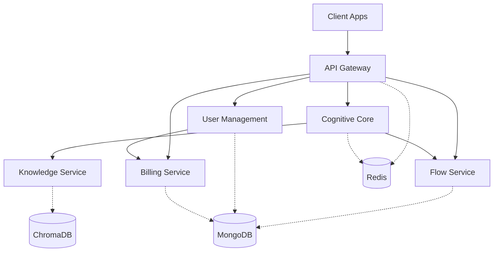

# 🏗️ Architecture Documentation

> Complete architectural guide for UX-Flow-Engine mono-repo

## Table of Contents
- [System Overview](#system-overview)
- [Mono-Repo Structure](#mono-repo-structure)
- [Microservices Architecture](#microservices-architecture)
- [Frontend Applications](#frontend-applications)
- [Communication Patterns](#communication-patterns)
- [Data Architecture](#data-architecture)
- [AI Agent Architecture](#ai-agent-architecture)
- [Deployment Architecture](#deployment-architecture)
- [Technology Stack](#technology-stack)

## System Overview

UX-Flow-Engine is built on a modern, scalable architecture designed for enterprise deployment:

### Architecture Principles
- **Microservices**: Loosely coupled, independently deployable services
- **Event-Driven**: Asynchronous communication via event bus
- **Cloud-Native**: Container-first, Kubernetes-ready
- **API-First**: RESTful APIs with OpenAPI specification
- **Domain-Driven Design**: Bounded contexts per service
- **CQRS Pattern**: Command-Query Responsibility Segregation
- **Reactive Architecture**: Non-blocking, event-driven flows

### System Characteristics
```yaml
Performance:
  Concurrent Users: 10,000+
  Response Time: <100ms (p50), <500ms (p99)
  Throughput: 1M requests/day
  Availability: 99.99% SLA

Scalability:
  Horizontal: Auto-scaling with K8s HPA
  Vertical: Resource limits per service
  Geographic: Multi-region deployment ready
  
Reliability:
  Fault Tolerance: Circuit breakers, retries
  Disaster Recovery: RPO 1hr, RTO 4hrs
  Backup Strategy: Daily snapshots, geo-redundant
```

## Mono-Repo Structure

### Directory Layout
```
ux-flow-engine/
├── apps/                           # Frontend applications
│   ├── web/                        # Main web application
│   │   ├── src/
│   │   │   ├── components/         # React components
│   │   │   ├── pages/              # Next.js pages
│   │   │   ├── hooks/              # Custom React hooks
│   │   │   ├── store/              # Redux/Zustand store
│   │   │   ├── services/           # API clients
│   │   │   └── utils/              # Utilities
│   │   ├── public/                 # Static assets
│   │   └── package.json
│   │
│   ├── admin/                      # Admin dashboard
│   │   ├── src/
│   │   │   ├── modules/            # Feature modules
│   │   │   ├── layouts/            # Layout components
│   │   │   ├── charts/             # Data visualization
│   │   │   └── config/             # Admin config
│   │   └── package.json
│   │
│   └── figma-plugin/               # Figma integration
│       ├── src/
│       │   ├── ui/                 # Plugin UI
│       │   ├── controller/         # Figma API controller
│       │   └── sync/               # Sync with backend
│       ├── manifest.json           # Figma manifest
│       └── package.json
│
├── services/                       # Backend microservices
│   ├── api-gateway/                # API Gateway (Port 3000)
│   ├── cognitive-core/             # AI Agents (Port 3001)
│   ├── knowledge-service/          # RAG System (Port 3002)
│   ├── flow-service/               # Flow Management (Port 3003)
│   ├── user-management/            # Auth & Users (Port 3004)
│   └── billing-service/            # Payments (Port 3005)
│
├── packages/                       # Shared packages
│   ├── common/                     # Shared utilities
│   │   ├── logger/                 # Logging utility
│   │   ├── errors/                 # Error classes
│   │   ├── validators/             # Validators
│   │   └── constants/              # Constants
│   │
│   ├── ui-components/              # Shared React components
│   │   ├── buttons/                # Button components
│   │   ├── forms/                  # Form components
│   │   ├── layouts/                # Layout components
│   │   └── modals/                 # Modal components
│   │
│   ├── types/                      # TypeScript definitions
│   │   ├── api/                    # API types
│   │   ├── models/                 # Data models
│   │   └── events/                 # Event types
│   │
│   └── sdk/                        # Client SDKs
│       ├── javascript/              # JS/TS SDK
│       ├── python/                 # Python SDK
│       └── go/                     # Go SDK
│
├── infrastructure/                 # Infrastructure as Code
│   ├── docker/                     # Docker configurations
│   │   ├── dockerfiles/            # Service Dockerfiles
│   │   └── docker-compose.yml      # Compose config
│   │
│   ├── kubernetes/                 # K8s manifests
│   │   ├── base/                   # Base configs
│   │   ├── overlays/               # Environment overlays
│   │   └── helm/                   # Helm charts
│   │
│   ├── terraform/                  # Infrastructure provisioning
│   │   ├── modules/                # Terraform modules
│   │   ├── environments/           # Environment configs
│   │   └── providers/              # Cloud providers
│   │
│   └── scripts/                    # Deployment scripts
│       ├── deploy.sh               # Deployment script
│       ├── rollback.sh             # Rollback script
│       └── health-check.sh         # Health checks
│
├── docs/                           # Documentation
│   ├── api/                        # API documentation
│   ├── architecture/               # Architecture docs
│   ├── guides/                     # User guides
│   └── development/                # Developer docs
│
├── tests/                          # Global tests
│   ├── e2e/                        # End-to-end tests
│   ├── integration/                # Integration tests
│   ├── load/                       # Load tests
│   └── security/                   # Security tests
│
├── tools/                          # Development tools
│   ├── generators/                 # Code generators
│   ├── migrations/                 # Database migrations
│   └── scripts/                    # Utility scripts
│
├── .github/                        # GitHub configurations
│   ├── workflows/                  # GitHub Actions
│   ├── ISSUE_TEMPLATE/             # Issue templates
│   └── PULL_REQUEST_TEMPLATE.md    # PR template
│
├── configs/                        # Global configurations
│   ├── eslint/                     # ESLint configs
│   ├── prettier/                   # Prettier configs
│   ├── jest/                       # Jest configs
│   └── tsconfig/                   # TypeScript configs
│
├── package.json                    # Root package.json
├── turbo.json                      # Turborepo config
├── nx.json                         # Nx config (alternative)
└── lerna.json                      # Lerna config (alternative)
```

### Mono-Repo Management

#### Package Management Strategy
```json
{
  "workspaces": [
    "apps/*",
    "services/*",
    "packages/*"
  ],
  "scripts": {
    "dev": "turbo run dev",
    "build": "turbo run build",
    "test": "turbo run test",
    "lint": "turbo run lint",
    "deploy": "turbo run deploy"
  }
}
```

#### Dependency Management
- **Shared Dependencies**: Hoisted to root
- **Service Dependencies**: Local to service
- **Version Management**: Synchronized versions
- **Package Publishing**: Private npm registry

## Microservices Architecture

### Service Communication Matrix



### Service Details

#### API Gateway (Port 3000)
```yaml
Responsibilities:
  - Request routing and load balancing
  - Authentication and authorization
  - Rate limiting and throttling
  - WebSocket management
  - Request/response transformation
  - API versioning
  - Circuit breaking

Technologies:
  - Express.js with TypeScript
  - WebSocket (ws library)
  - Redis for rate limiting
  - JWT for authentication

Scaling:
  - Horizontal: 2-10 instances
  - Load Balancer: nginx/HAProxy
  - Sticky Sessions: Redis-based
```

#### Cognitive Core (Port 3001)
```yaml
Responsibilities:
  - AI agent orchestration
  - Natural language processing
  - Task delegation and coordination
  - Response synthesis
  - Learning and optimization

AI Agents:
  - Manager Agent: Task coordination
  - Planner Agent: Execution planning
  - Architect Agent: Flow building
  - Validator Agent: Quality assurance
  - Classifier Agent: Intent analysis
  - Synthesizer Agent: Response composition
  - UX Expert Agent: Design advice
  - Visual Interpreter: Image analysis
  - Analyst Agent: System insights

Technologies:
  - Google Gemini API
  - Claude API (fallback)
  - Redis for state management
  - Worker threads for isolation
```

#### Knowledge Service (Port 3002)
```yaml
Responsibilities:
  - Document storage and retrieval
  - Vector embeddings management
  - Semantic search
  - RAG implementation
  - Knowledge graph management

Technologies:
  - ChromaDB for vectors
  - MongoDB for documents
  - OpenAI/Gemini embeddings
  - LangChain integration

Scaling:
  - Vertical: High memory instances
  - Caching: Redis for embeddings
  - Sharding: By workspace
```

#### Flow Service (Port 3003)
```yaml
Responsibilities:
  - Flow CRUD operations
  - Version control
  - Flow validation
  - Export/import
  - Collaboration features

Technologies:
  - MongoDB for storage
  - Redis for caching
  - GraphQL subscriptions
  - Joi for validation

Patterns:
  - Event Sourcing for history
  - CQRS for read/write split
  - Optimistic locking
```

#### User Management (Port 3004)
```yaml
Responsibilities:
  - User authentication
  - Authorization (RBAC)
  - Workspace management
  - SSO integration
  - Session management

Technologies:
  - JWT with refresh tokens
  - OAuth 2.0 providers
  - SAML 2.0 support
  - Argon2id for passwords
  - Redis for sessions

Security:
  - MFA support
  - Passwordless options
  - Biometric auth ready
```

#### Billing Service (Port 3005)
```yaml
Responsibilities:
  - Subscription management
  - Payment processing
  - Usage tracking
  - Invoice generation
  - Webhook handling

Technologies:
  - Stripe integration
  - MongoDB for records
  - Redis for idempotency
  - Bull for job queues

Features:
  - Tiered pricing
  - Usage-based billing
  - Credit system
  - Promotional codes
```

## Frontend Applications

### Main Web Application
```yaml
Framework: Next.js 14 with App Router
State Management: Zustand + React Query
Styling: Tailwind CSS + Shadcn/ui
Features:
  - Server-side rendering
  - Progressive Web App
  - Real-time collaboration
  - Offline support
  - Responsive design
```

### Admin Dashboard
```yaml
Framework: React with Vite
Components: Ant Design Pro
Charts: Recharts + D3.js
Features:
  - User management
  - Analytics dashboard
  - System monitoring
  - Billing management
  - Content moderation
```

### Figma Plugin
```yaml
Framework: React + Figma Plugin API
Communication: WebSocket + REST
Features:
  - Bi-directional sync
  - Real-time updates
  - Design system integration
  - Component mapping
  - Export to code
```

## Communication Patterns

### Synchronous Communication
```javascript
// REST API Pattern
GET /api/v1/flows/{id}
POST /api/v1/flows
PUT /api/v1/flows/{id}
DELETE /api/v1/flows/{id}

// GraphQL Pattern
query GetFlow($id: ID!) {
  flow(id: $id) {
    id
    name
    nodes
    edges
  }
}
```

### Asynchronous Communication
```javascript
// Event Bus Pattern
EventBus.publish('flow.created', {
  flowId: '123',
  userId: '456',
  timestamp: Date.now()
});

// WebSocket Pattern
ws.send(JSON.stringify({
  type: 'flow.update',
  data: flowData
}));
```

### Service Mesh
```yaml
Istio Configuration:
  - mTLS between services
  - Traffic management
  - Circuit breaking
  - Distributed tracing
  - Service discovery
```

## Data Architecture

### Database Schema

#### MongoDB Collections
```javascript
// Users Collection
{
  _id: ObjectId,
  email: String,
  passwordHash: String,
  profile: {
    name: String,
    avatar: String
  },
  workspaces: [ObjectId],
  createdAt: Date,
  updatedAt: Date
}

// Flows Collection
{
  _id: ObjectId,
  workspaceId: ObjectId,
  name: String,
  description: String,
  nodes: [{
    id: String,
    type: String,
    position: {x: Number, y: Number},
    data: Object
  }],
  edges: [{
    id: String,
    source: String,
    target: String,
    type: String
  }],
  versions: [{
    version: Number,
    changes: Object,
    createdBy: ObjectId,
    createdAt: Date
  }],
  createdAt: Date,
  updatedAt: Date
}
```

#### ChromaDB Collections
```python
# Embeddings Collection
collection = client.create_collection(
    name="knowledge_base",
    metadata={"hnsw:space": "cosine"}
)

# Document Structure
{
    "ids": ["doc1", "doc2"],
    "embeddings": [[...], [...]],
    "metadatas": [
        {"source": "manual", "type": "ux_pattern"},
        {"source": "generated", "type": "flow"}
    ],
    "documents": ["content1", "content2"]
}
```

### Caching Strategy
```yaml
Redis Caching:
  Session Data: 15 minutes TTL
  API Responses: 5 minutes TTL
  User Profiles: 1 hour TTL
  Flow Data: 10 minutes TTL
  
CDN Caching:
  Static Assets: 1 year
  API Responses: 5 minutes
  Images: 30 days
```

## AI Agent Architecture

### Agent Communication Flow
```
User Input
    ↓
[Classifier Agent]
    ↓
[Manager Agent] ←→ [Knowledge Service]
    ↓
[Specialized Agents]
    ├── [Planner Agent]
    ├── [Architect Agent]
    ├── [UX Expert Agent]
    └── [Visual Interpreter]
    ↓
[Validator Agent]
    ↓
[Synthesizer Agent]
    ↓
Response to User
```

### Agent Capabilities Matrix

| Agent | Input | Processing | Output |
|-------|-------|------------|--------|
| Manager | Task request | Delegation logic | Agent assignments |
| Planner | Requirements | Step generation | Execution plan |
| Architect | Flow spec | Structure building | Flow JSON |
| Validator | Flow data | Quality checks | Validation report |
| Classifier | User input | NLP analysis | Intent & entities |
| Synthesizer | Agent outputs | Response composition | Final response |
| UX Expert | Design query | Best practices | Recommendations |
| Visual | Images | Computer vision | Visual analysis |
| Analyst | System data | Pattern analysis | Insights |

## Deployment Architecture

### Kubernetes Deployment

```yaml
apiVersion: apps/v1
kind: Deployment
metadata:
  name: api-gateway
  namespace: ux-flow-engine
spec:
  replicas: 3
  selector:
    matchLabels:
      app: api-gateway
  template:
    metadata:
      labels:
        app: api-gateway
    spec:
      containers:
      - name: api-gateway
        image: uxflowengine/api-gateway:latest
        ports:
        - containerPort: 3000
        resources:
          requests:
            memory: "256Mi"
            cpu: "250m"
          limits:
            memory: "512Mi"
            cpu: "500m"
        env:
        - name: NODE_ENV
          value: "production"
        livenessProbe:
          httpGet:
            path: /health
            port: 3000
          initialDelaySeconds: 30
          periodSeconds: 10
```

### CI/CD Pipeline

```yaml
Pipeline Stages:
  1. Source:
     - Git webhook trigger
     - Branch protection rules
     
  2. Build:
     - Dependency installation
     - TypeScript compilation
     - Asset optimization
     
  3. Test:
     - Unit tests (Jest)
     - Integration tests
     - E2E tests (Cypress)
     
  4. Security:
     - Dependency scanning
     - SAST analysis
     - Container scanning
     
  5. Deploy:
     - Build Docker images
     - Push to registry
     - Update K8s manifests
     - Rolling deployment
     
  6. Verify:
     - Health checks
     - Smoke tests
     - Performance tests
```

### Multi-Region Deployment

```
Region: US-East-1 (Primary)
├── API Gateway (3 instances)
├── Cognitive Core (2 instances)
├── Knowledge Service (2 instances)
├── Flow Service (2 instances)
├── User Management (2 instances)
└── Billing Service (1 instance)

Region: EU-West-1 (Secondary)
├── API Gateway (2 instances)
├── Cognitive Core (1 instance)
├── Knowledge Service (1 instance)
├── Flow Service (1 instance)
├── User Management (1 instance)
└── Billing Service (1 instance)

Global Services:
├── CloudFront CDN
├── Route 53 DNS
├── S3 Storage
└── DynamoDB Global Tables
```

## Technology Stack

### Backend Technologies
| Category | Technology | Purpose |
|----------|------------|---------|
| Runtime | Node.js v20 | JavaScript runtime |
| Framework | Express.js | Web framework |
| Language | TypeScript | Type safety |
| Database | MongoDB | Document store |
| Cache | Redis | Caching & pub/sub |
| Vector DB | ChromaDB | Embeddings |
| Queue | Bull | Job processing |
| Search | Elasticsearch | Full-text search |

### Frontend Technologies
| Category | Technology | Purpose |
|----------|------------|---------|
| Framework | Next.js 14 | React framework |
| State | Zustand | State management |
| Styling | Tailwind CSS | Utility CSS |
| Components | Shadcn/ui | Component library |
| Forms | React Hook Form | Form handling |
| Charts | Recharts | Data visualization |
| Animation | Framer Motion | Animations |
| Testing | Cypress | E2E testing |

### DevOps Technologies
| Category | Technology | Purpose |
|----------|------------|---------|
| Containers | Docker | Containerization |
| Orchestration | Kubernetes | Container orchestration |
| CI/CD | GitHub Actions | Automation |
| Monitoring | Prometheus | Metrics |
| Logging | ELK Stack | Log aggregation |
| Tracing | Jaeger | Distributed tracing |
| Service Mesh | Istio | Service communication |
| IaC | Terraform | Infrastructure |

### AI/ML Technologies
| Category | Technology | Purpose |
|----------|------------|---------|
| LLM | Google Gemini | Primary AI |
| LLM | Claude 3 | Fallback AI |
| Embeddings | OpenAI Ada | Text embeddings |
| Framework | LangChain | AI orchestration |
| Vector Search | FAISS | Similarity search |
| NLP | spaCy | Text processing |

## Performance Optimization

### Backend Optimization
- **Connection Pooling**: MongoDB & Redis pools
- **Query Optimization**: Indexed queries, projections
- **Caching Strategy**: Multi-level caching
- **Async Processing**: Event-driven architecture
- **Resource Limits**: CPU & memory constraints

### Frontend Optimization
- **Code Splitting**: Dynamic imports
- **Image Optimization**: Next.js Image component
- **Bundle Size**: Tree shaking, minification
- **Lazy Loading**: Components & routes
- **Service Workers**: Offline support

### Network Optimization
- **CDN**: Static asset delivery
- **Compression**: Gzip/Brotli
- **HTTP/2**: Multiplexing
- **Prefetching**: DNS & preconnect
- **Caching Headers**: Browser caching

## Monitoring & Observability

### Metrics Collection
```yaml
Prometheus Metrics:
  - Request rate (req/s)
  - Response time (p50, p95, p99)
  - Error rate (4xx, 5xx)
  - CPU usage (%)
  - Memory usage (MB)
  - Database connections
  - Cache hit rate
  - WebSocket connections
```

### Logging Strategy
```javascript
// Structured Logging
{
  "timestamp": "2024-01-01T00:00:00Z",
  "level": "info",
  "service": "api-gateway",
  "traceId": "abc123",
  "spanId": "def456",
  "userId": "user123",
  "message": "Request processed",
  "metadata": {
    "path": "/api/v1/flows",
    "method": "GET",
    "statusCode": 200,
    "duration": 45
  }
}
```

### Alerting Rules
```yaml
Alerts:
  - High Error Rate: >1% 5xx errors
  - High Latency: p99 >1s
  - Low Availability: <99.9%
  - High CPU: >80% for 5min
  - High Memory: >90% for 5min
  - Database Connection Pool: >80%
  - Disk Usage: >85%
```

## Disaster Recovery

### Backup Strategy
```yaml
Backup Schedule:
  - Database: Daily full, hourly incremental
  - File Storage: Daily snapshots
  - Configuration: Version controlled
  - Secrets: Encrypted vault backup

Retention Policy:
  - Daily: 7 days
  - Weekly: 4 weeks
  - Monthly: 12 months
  - Yearly: 7 years (compliance)
```

### Recovery Procedures
1. **Service Failure**: Auto-restart, circuit breaker
2. **Database Failure**: Failover to replica
3. **Region Failure**: DNS failover to secondary
4. **Complete Failure**: Restore from backup

### RTO/RPO Targets
- **RPO (Recovery Point Objective)**: 1 hour
- **RTO (Recovery Time Objective)**: 4 hours
- **Availability Target**: 99.99% (52 minutes/year)

---

**Last Updated**: December 2024  
**Architecture Review**: Quarterly  
**Contact**: architecture@uxflowengine.com

*This document represents the current and planned architecture of UX-Flow-Engine.*