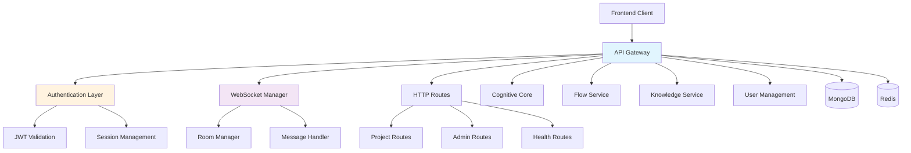

# API Gateway Service

[](https://github.com/ux-flow-engine/api-gateway)
[](./package.json)
[](https://nodejs.org/)
[](LICENSE)

> **Central entry point and real-time communication hub for the UX-Flow-Engine ecosystem**

The API Gateway serves as the unified interface for all client interactions, handling HTTP REST API requests, WebSocket connections for real-time collaboration, authentication/authorization, and intelligent routing to downstream microservices.

## 🏛️ Architecture Overview



## 🎯 Service Overview

### Primary Responsibilities

- **🌐 API Gateway**: Single entry point for all client HTTP requests
- **🔐 Authentication**: JWT token validation and user session management
- **⚡ Real-time Communication**: WebSocket connections for live collaboration
- **🛡️ Security**: Rate limiting, CORS, input validation, and security headers
- **📡 Event Orchestration**: Inter-service communication via Redis pub/sub
- **🎯 Request Routing**: Intelligent routing to appropriate microservices

### Service Dependencies

| Service | Type | Purpose | Critical |
|---------|------|---------|----------|
| MongoDB | Database | User, project, and conversation persistence | Yes |
| Redis | Cache/PubSub | Session storage, event bus, room management | Yes |
| Cognitive Core | Microservice | AI conversation processing | Yes |
| Flow Service | Microservice | Flow data management | Yes |
| Knowledge Service | Microservice | Knowledge retrieval (optional) | No |
| User Management | Microservice | User authentication and management | Yes |

## 🚀 Getting Started

### Prerequisites

```bash
# Required software versions
node --version    # >= 18.0.0
npm --version     # >= 8.0.0
```

### Installation

```bash
# Clone repository
git clone <repository-url>
cd services/api-gateway

# Install dependencies
npm install

# Setup environment
cp .env.example .env
# Edit .env with your configuration values
```

### Environment Variables

| Variable | Required | Default | Description |
|----------|----------|---------|-------------|
| `API_GATEWAY_PORT` | ❌ | `3000` | HTTP server port |
| `NODE_ENV` | ✅ | `development` | Environment mode |
| `MONGODB_URI` | ✅ | - | MongoDB connection string |
| `REDIS_URL` | ✅ | - | Redis connection string |
| `JWT_SECRET` | ✅ | - | JWT signing secret |
| `JWT_EXPIRES_IN` | ❌ | `7d` | JWT expiration time |
| `CORS_ORIGINS` | ❌ | `*` | Allowed CORS origins (comma-separated) |
| `RATE_LIMIT_WINDOW_MS` | ❌ | `900000` | Rate limit window (15min) |
| `RATE_LIMIT_MAX_REQUESTS` | ❌ | `100` | Max requests per window |
| `LOG_LEVEL` | ❌ | `info` | Logging verbosity |

### Quick Start

```bash
# Development mode with hot reload
npm run dev

# Production mode
npm start

# Run tests
npm test

# Run with coverage
npm run test:coverage
```

## 📡 API Reference

### Base URLs

- **Development**: `http://localhost:3000`
- **Production**: `https://api.uxflow.app`

### Authentication

All protected endpoints require JWT authentication:

```http
Authorization: Bearer <jwt_token>
```

### Core Endpoints

#### Authentication

##### `POST /api/v1/auth/register`

Register a new user account.

**Request Body:**
```json
{
  "email": "user@example.com",
  "password": "securePassword123",
  "firstName": "John",
  "lastName": "Doe",
  "workspaceName": "My Workspace"
}
```

**Response (201):**
```json
{
  "message": "User registered successfully",
  "user": {
    "id": "507f1f77bcf86cd799439011",
    "email": "user@example.com",
    "firstName": "John",
    "lastName": "Doe",
    "workspaceId": "507f1f77bcf86cd799439012",
    "role": "user",
    "emailVerified": false
  },
  "token": "eyJhbGciOiJIUzI1NiIsInR5cCI6IkpXVCJ9...",
  "expiresIn": "7d"
}
```

##### `POST /api/v1/auth/login`

Authenticate user and receive JWT token.

**Request Body:**
```json
{
  "email": "user@example.com",
  "password": "securePassword123"
}
```

**Response (200):**
```json
{
  "message": "Login successful",
  "user": {
    "id": "507f1f77bcf86cd799439011",
    "email": "user@example.com",
    "firstName": "John",
    "lastName": "Doe",
    "workspaceId": "507f1f77bcf86cd799439012",
    "role": "user",
    "emailVerified": true
  },
  "token": "eyJhbGciOiJIUzI1NiIsInR5cCI6IkpXVCJ9...",
  "expiresIn": "7d"
}
```

#### Projects

##### `GET /api/v1/projects`

List user's accessible projects with pagination.

**Headers:**
```http
Authorization: Bearer <token>
```

**Query Parameters:**
- `page` (number): Page number (default: 1)
- `limit` (number): Items per page (default: 20, max: 100)
- `search` (string): Search in name/description
- `status` (string): Filter by status (active|inactive|deleted)

**Response (200):**
```json
{
  "projects": [
    {
      "id": "507f1f77bcf86cd799439013",
      "name": "Login Flow Design",
      "description": "User authentication flow",
      "ownerId": "507f1f77bcf86cd799439011",
      "status": "active",
      "visibility": "private",
      "flowMetadata": {
        "nodeCount": 5,
        "edgeCount": 4,
        "lastModifiedBy": "507f1f77bcf86cd799439011",
        "version": "1.2.0"
      },
      "createdAt": "2024-01-01T10:00:00Z",
      "updatedAt": "2024-01-15T14:30:00Z"
    }
  ],
  "pagination": {
    "page": 1,
    "limit": 20,
    "totalCount": 45,
    "totalPages": 3,
    "hasNext": true,
    "hasPrev": false
  }
}
```

##### `POST /api/v1/projects`

Create a new project.

**Headers:**
```http
Authorization: Bearer <token>
```

**Request Body:**
```json
{
  "name": "New Flow Project",
  "description": "Project description",
  "visibility": "private",
  "template": "login_flow"
}
```

**Response (201):**
```json
{
  "message": "Project created successfully",
  "project": {
    "id": "507f1f77bcf86cd799439014",
    "name": "New Flow Project",
    "description": "Project description",
    "ownerId": "507f1f77bcf86cd799439011",
    "workspaceId": "507f1f77bcf86cd799439012",
    "status": "active",
    "visibility": "private",
    "flowMetadata": {
      "nodeCount": 1,
      "edgeCount": 0,
      "version": "1.0.0"
    },
    "createdAt": "2024-01-20T09:15:00Z"
  }
}
```

#### Health Check

##### `GET /health`

Service health status and dependencies.

**Response (200):**
```json
{
  "service": "api-gateway",
  "status": "healthy",
  "version": "2.0.0",
  "environment": "production",
  "uptime": 86400,
  "dependencies": {
    "mongodb": "healthy",
    "redis": "healthy",
    "websocket": "healthy"
  },
  "websocketConnections": {
    "totalConnections": 42,
    "activeConnections": 35
  },
  "timestamp": "2024-01-20T10:00:00Z"
}
```

### Error Responses

All endpoints return consistent error responses:

```json
{
  "error": {
    "code": "VALIDATION_ERROR",
    "message": "Request validation failed",
    "details": [
      {
        "field": "email",
        "message": "Email is required",
        "value": ""
      }
    ],
    "correlationId": "req_1642680900_abc123",
    "timestamp": "2024-01-20T09:15:00Z"
  }
}
```

**Common Error Codes:**
- `VALIDATION_ERROR` (400) - Request validation failed
- `AUTHENTICATION_ERROR` (401) - Invalid or expired token
- `AUTHORIZATION_ERROR` (403) - Insufficient permissions
- `NOT_FOUND` (404) - Resource not found
- `CONFLICT` (409) - Resource conflict
- `RATE_LIMIT_EXCEEDED` (429) - Too many requests
- `INTERNAL_ERROR` (500) - Server error

## 🌐 WebSocket API

### Connection

```javascript
const ws = new WebSocket('ws://localhost:3000?token=JWT_TOKEN&projectId=PROJECT_ID');
```

### Connection Flow

1. **Authentication**: JWT token validated before WebSocket upgrade
2. **Authorization**: Project access permissions verified
3. **Room Assignment**: User joined to project-specific room
4. **Connection Confirmation**: `connection_established` message sent

### Message Types

#### Incoming Messages (Client → Server)

##### User Message
```json
{
  "type": "user_message",
  "message": "Add a login screen with email and password fields",
  "qualityMode": "standard|detailed|creative",
  "messageId": "msg_1642680900_abc123"
}
```

##### Plan Approval
```json
{
  "type": "plan_approved",
  "approved": true,
  "plan": [...],
  "currentFlow": {...},
  "feedback": "Optional feedback if approved=false"
}
```

##### Image Upload
```json
{
  "type": "image_upload",
  "imageData": "data:image/jpeg;base64,/9j/4AAQSkZJRgABAQAA...",
  "mimeType": "image/jpeg",
  "description": "Login screen mockup"
}
```

##### Cursor Position (Collaboration)
```json
{
  "type": "cursor_position",
  "x": 250,
  "y": 180,
  "elementId": "node_login_screen",
  "userName": "John Doe"
}
```

#### Outgoing Messages (Server → Client)

##### Connection Established
```json
{
  "type": "connection_established",
  "clientId": "client_507f1f77bcf86cd799439011_1642680900_abc123",
  "projectId": "507f1f77bcf86cd799439013",
  "connectedAt": "2024-01-20T09:30:00Z"
}
```

##### Assistant Response
```json
{
  "type": "assistant_response",
  "message": "I'll help you add a login screen. Here's my plan:",
  "responseType": "plan_for_approval",
  "plan": [
    {
      "step": 1,
      "action": "Create login screen node",
      "description": "Add new screen node with email and password fields"
    }
  ],
  "correlationId": "evt_1642680900_abc123"
}
```

##### Flow Updated
```json
{
  "type": "flow_updated",
  "flow": {
    "nodes": [...],
    "edges": [...]
  },
  "updatedBy": "507f1f77bcf86cd799439011",
  "changeType": "node_added"
}
```

##### Error Message
```json
{
  "type": "error",
  "message": "Failed to process message",
  "error": "ValidationError: Message content is required",
  "code": "VALIDATION_ERROR",
  "correlationId": "evt_1642680900_abc123"
}
```

## 🔒 Security Features

### Authentication & Authorization

- **JWT Tokens**: HS256 algorithm with configurable expiration
- **Session Management**: Redis-based session storage
- **Permission System**: Role-based access control (RBAC)
- **Token Refresh**: Automatic token refresh mechanism

### Security Middleware

- **Helmet.js**: Security headers (CSP, HSTS, X-Frame-Options)
- **CORS**: Configurable cross-origin resource sharing
- **Rate Limiting**: Sliding window rate limiting per IP/user
- **Input Validation**: Joi schema validation for all endpoints
- **Request Sanitization**: XSS and injection attack prevention

### WebSocket Security

- **Authentication**: JWT validation before WebSocket upgrade
- **Authorization**: Project-level access control
- **Message Validation**: Schema validation for all WebSocket messages
- **Connection Limits**: Max connections per user/IP

## 📁 Project Structure

```
src/
├── config/
│   └── index.js              # Configuration management
├── middleware/
│   ├── auth.js               # Authentication middleware
│   ├── cors.js               # CORS configuration
│   ├── error-handler.js      # Global error handling
│   └── rate-limit.js         # Rate limiting configuration
├── routes/
│   ├── admin.js              # Admin endpoints
│   ├── auth.js               # Authentication endpoints
│   ├── health.js             # Health check endpoints
│   └── projects.js           # Project management endpoints
├── websocket/
│   ├── connection-manager.js # WebSocket connection management
│   ├── message-handler.js    # Message processing and routing
│   └── room-manager.js       # Project room management
└── server.js                 # Main application entry point

tests/
├── auth.test.js              # Authentication tests
├── integration.test.js       # Integration tests
└── websocket.test.js         # WebSocket tests
```

## 🧪 Testing

### Running Tests

```bash
# Unit tests
npm test

# Integration tests (requires MongoDB and Redis)
npm run test:integration

# WebSocket tests
npm run test:websocket

# Coverage report
npm run test:coverage

# Watch mode for development
npm run test:watch
```

### Test Configuration

Tests use Jest with the following setup:
- **Unit Tests**: Mock external dependencies
- **Integration Tests**: Use test database instances
- **WebSocket Tests**: Real WebSocket connections with test clients
- **Coverage**: Minimum 80% coverage required

### Example Test

```javascript
describe('Authentication', () => {
  it('should authenticate valid user', async () => {
    const response = await request(app)
      .post('/api/v1/auth/login')
      .send({
        email: 'test@example.com',
        password: 'password123'
      });

    expect(response.status).toBe(200);
    expect(response.body.token).toBeDefined();
    expect(response.body.user.email).toBe('test@example.com');
  });
});
```

## 📊 Performance Metrics

### Expected Performance

- **HTTP Throughput**: 1,000 requests/second
- **WebSocket Capacity**: 500 concurrent connections
- **Response Time**: < 100ms (95th percentile)
- **Memory Usage**: ~200MB baseline (scales with connections)
- **CPU Usage**: ~15% baseline (spikes during auth bursts)

### Performance Optimizations

- **Connection Pooling**: MongoDB and Redis connection pools
- **Message Broadcasting**: Redis pub/sub for horizontal scaling
- **Caching**: User sessions and project metadata caching
- **Compression**: WebSocket message compression
- **Keep-Alive**: HTTP keep-alive for persistent connections

## 📈 Monitoring & Observability

### Health Monitoring

- **Health Endpoint**: `/health` - Comprehensive dependency checks
- **Metrics Endpoint**: `/metrics` - Prometheus-compatible metrics
- **Readiness Probe**: Database and cache connectivity
- **Liveness Probe**: Service responsiveness check

### Key Metrics

- `http_requests_total` - Total HTTP requests by method and status
- `http_request_duration_seconds` - HTTP request latency histogram
- `websocket_connections_active` - Active WebSocket connections
- `websocket_messages_total` - WebSocket messages by type
- `auth_attempts_total` - Authentication attempts by result
- `rate_limit_hits_total` - Rate limit violations

### Logging

Structured JSON logging with correlation IDs:

```json
{
  "timestamp": "2024-01-20T10:00:00Z",
  "level": "info",
  "service": "api-gateway",
  "message": "User authenticated successfully",
  "correlationId": "req_1642680900_abc123",
  "userId": "507f1f77bcf86cd799439011",
  "metadata": {
    "endpoint": "/api/v1/auth/login",
    "responseTime": 150,
    "userAgent": "Mozilla/5.0..."
  }
}
```

### Alerting

| Condition | Threshold | Severity | Response |
|-----------|-----------|----------|----------|
| HTTP Error Rate | > 5% | Critical | Immediate investigation |
| Response Time p95 | > 2s | High | Performance review |
| WebSocket Failures | > 10% | Medium | WebSocket infrastructure check |
| Auth Failure Rate | > 20% | High | Security incident response |
| Memory Usage | > 85% | Medium | Memory leak investigation |

## 🔧 Troubleshooting

### Common Issues

#### Service Won't Start

```bash
# Check logs
docker logs api-gateway-container

# Verify environment variables
env | grep -E "(MONGODB|REDIS|JWT)"

# Test database connectivity
npm run test:db

# Check port availability
lsof -i :3000
```

#### WebSocket Connection Failures

1. **Token Issues**: Verify JWT token validity and expiration
2. **CORS Problems**: Check WebSocket CORS configuration
3. **Redis Connectivity**: Confirm Redis connection for room management
4. **Rate Limiting**: Review rate limiting settings
5. **Project Access**: Verify user has project access permissions

#### High Authentication Failure Rate

1. **JWT Configuration**: Check JWT secret consistency across services
2. **Database Issues**: Verify MongoDB user collection accessibility
3. **Rate Limiting**: Review auth endpoint rate limits
4. **Performance**: Check bcrypt performance under load
5. **Security**: Analyze patterns for potential attacks

#### Performance Degradation

1. **Database Performance**: Monitor query execution times and add indexes
2. **Redis Performance**: Check connection pool utilization
3. **Memory Leaks**: Monitor WebSocket connection cleanup
4. **Rate Limiting**: Verify rate limiting effectiveness
5. **Event Processing**: Check Redis pub/sub performance

### Debug Mode

```bash
# Enable debug logging
LOG_LEVEL=debug npm run dev

# Enable WebSocket debugging
DEBUG=websocket:* npm run dev

# Enable authentication debugging
DEBUG=auth:* npm run dev
```

## 🚀 Deployment

### Docker Deployment

```bash
# Build image
docker build -t ux-flow/api-gateway:latest .

# Run with dependencies
docker-compose up -d
```

### Kubernetes Deployment

```yaml
apiVersion: apps/v1
kind: Deployment
metadata:
  name: api-gateway
spec:
  replicas: 3
  selector:
    matchLabels:
      app: api-gateway
  template:
    metadata:
      labels:
        app: api-gateway
    spec:
      containers:
      - name: api-gateway
        image: ux-flow/api-gateway:latest
        ports:
        - containerPort: 3000
        env:
        - name: MONGODB_URI
          valueFrom:
            secretKeyRef:
              name: mongodb-secret
              key: uri
        - name: REDIS_URL
          valueFrom:
            secretKeyRef:
              name: redis-secret
              key: url
        - name: JWT_SECRET
          valueFrom:
            secretKeyRef:
              name: jwt-secret
              key: secret
```

### Environment Configuration

| Environment | MongoDB | Redis | CORS Origins |
|-------------|---------|-------|--------------|
| Development | Local instance | Local instance | `*` |
| Staging | MongoDB Atlas | Redis Cloud | `staging.uxflow.app` |
| Production | MongoDB Atlas | Redis Cloud | `app.uxflow.app` |

## 🔄 Event System Integration

### Published Events

#### `USER_MESSAGE_RECEIVED`
```json
{
  "eventType": "USER_MESSAGE_RECEIVED",
  "eventId": "evt_1642680900_abc123",
  "timestamp": "2024-01-20T10:00:00Z",
  "emittedBy": "api-gateway",
  "data": {
    "userId": "507f1f77bcf86cd799439011",
    "projectId": "507f1f77bcf86cd799439013",
    "message": "Add a login screen",
    "qualityMode": "standard"
  }
}
```

#### `USER_PLAN_APPROVED`
```json
{
  "eventType": "USER_PLAN_APPROVED",
  "eventId": "evt_1642680900_def456",
  "timestamp": "2024-01-20T10:05:00Z",
  "emittedBy": "api-gateway",
  "data": {
    "userId": "507f1f77bcf86cd799439011",
    "projectId": "507f1f77bcf86cd799439013",
    "approved": true,
    "plan": [...],
    "currentFlow": {...}
  }
}
```

### Consumed Events

#### `USER_RESPONSE_READY`
Forwards AI responses to WebSocket clients.

#### `FLOW_UPDATED`
Broadcasts flow changes to project collaborators.

## 📚 Related Services

- **[Cognitive Core](../cognitive-core/README.md)**: Multi-agent AI conversation processing
- **[Flow Service](../flow-service/README.md)**: Flow data management and persistence
- **[Knowledge Service](../knowledge-service/README.md)**: Knowledge retrieval and RAG
- **[User Management](../user-management/README.md)**: User authentication and workspace management

## 📖 Additional Documentation

- [System Architecture](../../docs/ARCHITECTURE.md)
- [API Reference](../../docs/API_REFERENCE.md)
- [Deployment Guide](../../docs/DEPLOYMENT.md)
- [Development Setup](../../docs/DEVELOPMENT.md)
- [WebSocket Protocol](../../docs/WEBSOCKET_PROTOCOL.md)

## 🤝 Contributing

Please read our [Contributing Guide](../../CONTRIBUTING.md) for development and contribution guidelines.

## 📄 License

This project is licensed under the MIT License - see the [LICENSE](../../LICENSE) file for details.

---

**Service Owner**: API Gateway Team  
**Last Updated**: 2024-01-20  
**Version**: 2.0.0