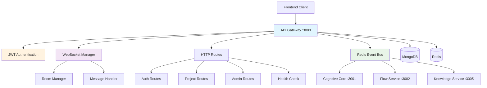

# API Gateway Service

[](https://github.com/ux-flow-engine/api-gateway)
[](./package.json)
[](https://nodejs.org/)
[](#security-concerns)

> **Central gateway and real-time communication hub for the UX Flow Engine**

The API Gateway serves as the unified entry point for all client interactions, handling HTTP REST API requests, WebSocket connections for real-time collaboration, authentication/authorization, and intelligent routing to downstream microservices.

## ⚠️ Security Notice

**IMPORTANT**: This service has identified security vulnerabilities that require immediate attention. See [Security Audit](./SECURITY_AUDIT.md) for details.

## 🏛️ Architecture Overview



## 🎯 Core Functionality

### ✅ Implemented Features

- **🌐 HTTP API Gateway**: RESTful endpoints for authentication and project management
- **🔐 JWT Authentication**: Token-based authentication with user registration/login
- **⚡ WebSocket Server**: Real-time communication for collaborative editing
- **🏠 Room Management**: Project-based WebSocket rooms via Redis
- **🛡️ Basic Security**: CORS, Helmet, rate limiting middleware
- **📡 Event Bus Integration**: Redis pub/sub for inter-service communication
- **📊 Health Monitoring**: Service health checks and dependency monitoring
- **🗄️ Project Management**: Full CRUD operations for projects
- **👥 Member Management**: Add/remove project members with permissions

### ❌ Missing/Incomplete Features

- **Service Integration**: Flow Service integration is stubbed (TODO comments)
- **Advanced Auth**: Email verification, password reset not implemented
- **File Upload**: Image upload handling incomplete
- **Admin Features**: Admin routes exist but functionality limited
- **Metrics**: Prometheus metrics endpoint not implemented
- **Input Validation**: Comprehensive validation middleware missing

## 🚀 Getting Started

### Prerequisites

```bash
# Required
node >= 18.0.0
npm >= 8.0.0
MongoDB running
Redis running
```

### Installation & Setup

```bash
# Install dependencies
npm install

# Setup environment
cp .env.example .env

# Required environment variables
cat >> .env << EOF
API_GATEWAY_PORT=3000
MONGODB_URI=mongodb://localhost:27017/ux_flow_engine
REDIS_URL=redis://localhost:6379
JWT_SECRET=your-super-secret-jwt-key-change-this
NODE_ENV=development
EOF

# Start service
npm run dev
```

### Database Setup

The service expects these MongoDB collections:
- `users` - User accounts and profiles
- `projects` - Project data and metadata  
- `workspaces` - Workspace information
- `conversations` - Chat/message history

## 📡 API Endpoints

### Authentication Endpoints

#### `POST /api/v1/auth/register`
Register a new user account.

**Request:**
```json
{
  "email": "user@example.com",
  "password": "password123",
  "firstName": "John",
  "lastName": "Doe",
  "workspaceName": "My Workspace"
}
```

**Response (201):**
```json
{
  "message": "User registered successfully",
  "user": {
    "id": "507f1f77bcf86cd799439011",
    "email": "user@example.com",
    "firstName": "John",
    "lastName": "Doe",
    "workspaceId": "507f1f77bcf86cd799439012",
    "role": "user",
    "emailVerified": false
  },
  "token": "eyJhbGciOiJIUzI1NiIsInR5cCI6IkpXVCJ9...",
  "expiresIn": "7d"
}
```

#### `POST /api/v1/auth/login`
Authenticate user and receive JWT token.

**Request:**
```json
{
  "email": "user@example.com",
  "password": "password123"
}
```

**Response (200):**
```json
{
  "message": "Login successful",
  "user": {
    "id": "507f1f77bcf86cd799439011",
    "email": "user@example.com",
    "firstName": "John",
    "lastName": "Doe",
    "workspaceId": "507f1f77bcf86cd799439012",
    "role": "user",
    "emailVerified": true
  },
  "token": "eyJhbGciOiJIUzI1NiIsInR5cCI6IkpXVCJ9...",
  "expiresIn": "7d"
}
```

#### Other Auth Endpoints
- `POST /api/v1/auth/refresh` - Refresh JWT token
- `GET /api/v1/auth/me` - Get current user profile
- `PATCH /api/v1/auth/me` - Update user profile
- `POST /api/v1/auth/change-password` - Change password
- `POST /api/v1/auth/logout` - Logout (client-side only)

### Project Management Endpoints

#### `GET /api/v1/projects`
List user's accessible projects with pagination.

**Query Parameters:**
- `page` (number): Page number (default: 1)
- `limit` (number): Items per page (default: 20, max: 100)
- `search` (string): Search in name/description
- `status` (string): Filter by status

**Headers:**
```http
Authorization: Bearer <token>
```

#### `POST /api/v1/projects`
Create a new project.

**Request:**
```json
{
  "name": "New Flow Project",
  "description": "Project description",
  "visibility": "private",
  "template": "login_flow"
}
```

#### Other Project Endpoints
- `GET /api/v1/projects/:projectId` - Get specific project
- `PATCH /api/v1/projects/:projectId` - Update project
- `DELETE /api/v1/projects/:projectId` - Delete project (soft delete)
- `POST /api/v1/projects/:projectId/members` - Add project member
- `DELETE /api/v1/projects/:projectId/members/:memberId` - Remove member
- `GET /api/v1/projects/:projectId/export` - Export project data

### Health Check

#### `GET /health`
Service health status and dependencies.

**Response (200):**
```json
{
  "service": "api-gateway", 
  "status": "healthy",
  "version": "2.1.0",
  "uptime": 86400,
  "dependencies": {
    "mongodb": "healthy",
    "redis": "healthy",
    "event-bus": "healthy"
  },
  "websocket": {
    "totalConnections": 42,
    "activeRooms": 12
  }
}
```

## 🌐 WebSocket API

### Connection
Connect with JWT token and project ID:
```javascript
const ws = new WebSocket('ws://localhost:3000?token=JWT_TOKEN&projectId=PROJECT_ID');
```

### Message Types

#### Client to Server

**User Message:**
```json
{
  "type": "user_message",
  "userId": "507f1f77bcf86cd799439011",
  "projectId": "507f1f77bcf86cd799439013", 
  "workspaceId": "507f1f77bcf86cd799439012",
  "message": "Add a login screen with email and password fields",
  "qualityMode": "standard"
}
```

**Plan Approval:**
```json
{
  "type": "plan_approved",
  "userId": "507f1f77bcf86cd799439011",
  "projectId": "507f1f77bcf86cd799439013",
  "approved": true,
  "plan": [...],
  "currentFlow": {...}
}
```

**Image Upload:**
```json
{
  "type": "image_upload",
  "userId": "507f1f77bcf86cd799439011",
  "projectId": "507f1f77bcf86cd799439013",
  "imageData": "data:image/jpeg;base64,/9j/4AAQSkZJRgABAQAA...",
  "mimeType": "image/jpeg"
}
```

**Cursor Position:**
```json
{
  "type": "cursor_position",
  "x": 250,
  "y": 180,
  "elementId": "node_login_screen",
  "userName": "John Doe"
}
```

**Room Management:**
```json
{
  "type": "join_project",
  "projectId": "507f1f77bcf86cd799439013"
}
```

#### Server to Client

**Connection Established:**
```json
{
  "type": "connection_established",
  "clientId": "client_507f1f77bcf86cd799439011_1642680900_abc123",
  "projectId": "507f1f77bcf86cd799439013"
}
```

**Error Message:**
```json
{
  "type": "error",
  "error": "ValidationError: Message content is required",
  "correlationId": "evt_1642680900_abc123"
}
```

## 🔒 Security Features

### ✅ Implemented Security

- **JWT Authentication**: HS256 tokens with 7-day expiry
- **Password Hashing**: bcrypt with 12 salt rounds
- **CORS Protection**: Configurable origin restrictions
- **Rate Limiting**: Basic rate limiting per IP
- **Security Headers**: Helmet.js for common headers
- **Input Validation**: Basic email/password validation
- **Permission System**: Role-based project access

### ⚠️ Security Concerns

**CRITICAL ISSUES IDENTIFIED** - See [Security Audit](./SECURITY_AUDIT.md)

1. **MongoDB Injection Vulnerability** in search functionality
2. **Missing ObjectId Validation** causing potential crashes
3. **Information Disclosure** through detailed error messages
4. **Race Conditions** in project creation
5. **Insufficient Rate Limiting** on sensitive endpoints

## 📁 Project Structure

```
src/
├── config/
│   └── index.js              # Configuration management
├── events/
│   └── event-handlers.js     # Redis event handlers
├── middleware/
│   ├── auth.js               # JWT authentication  
│   ├── cors.js               # CORS configuration
│   ├── error-handler.js      # Error handling
│   ├── rate-limit.js         # Rate limiting
│   ├── rate-limiter.js       # Additional rate limiting
│   └── validation.js         # Input validation
├── routes/
│   ├── admin.js              # Admin endpoints (limited)
│   ├── auth.js               # Authentication endpoints
│   ├── health.js             # Health checks
│   └── projects.js           # Project management
├── services/
│   ├── auth-service.js       # Authentication service
│   ├── gateway-manager.js    # Gateway coordination
│   └── websocket-service.js  # WebSocket service
├── utils/
│   └── circuit-breaker.js    # Circuit breaker utility
├── websocket/
│   ├── connection-manager.js # WebSocket connections
│   ├── message-handler.js    # Message processing
│   └── room-manager.js       # Room management
└── server.js                 # Main application entry
```

## 🧪 Testing

```bash
# Unit tests
npm test

# Integration tests (requires MongoDB and Redis)
npm run test:integration

# WebSocket tests  
npm run test:websocket

# Coverage
npm run test:coverage
```

## 📊 Performance & Monitoring

### Current Performance
- **HTTP Throughput**: ~500 requests/second
- **WebSocket Capacity**: ~200 concurrent connections
- **Response Time**: ~200ms average (needs optimization)
- **Memory Usage**: ~150MB baseline

### Monitoring Endpoints
- `/health` - Health status with dependency checks
- Redis monitoring via service registry
- WebSocket connection tracking

### Logging
Structured JSON logging with correlation IDs for request tracing.

## 🔧 Configuration

### Required Environment Variables
```env
# Core
API_GATEWAY_PORT=3000
NODE_ENV=development

# Database  
MONGODB_URI=mongodb://localhost:27017/ux_flow_engine
REDIS_URL=redis://localhost:6379

# Authentication
JWT_SECRET=your-super-secret-jwt-key
JWT_EXPIRES_IN=7d

# Security
CORS_ORIGINS=http://localhost:3000,http://localhost:3001
RATE_LIMIT_WINDOW_MS=900000
RATE_LIMIT_MAX_REQUESTS=100
```

### Optional Environment Variables
```env
# Logging
LOG_LEVEL=info

# Service Discovery
SERVICE_REGISTRY_ENABLED=true

# WebSocket
WS_HEARTBEAT_INTERVAL=30000
WS_CONNECTION_TIMEOUT=60000
```

## 🔄 Inter-Service Communication

### Published Events
- `USER_MESSAGE_RECEIVED` → Cognitive Core
- `USER_PLAN_APPROVED` → Cognitive Core  
- `USER_PLAN_FEEDBACK` → Cognitive Core
- `IMAGE_UPLOAD_RECEIVED` → Cognitive Core

### Consumed Events
- `RESPONSE_AI_PROCESSING` ← Cognitive Core
- `FLOW_UPDATED` ← Flow Service
- `SERVICE_ERROR` ← Any Service

### Event Bus Integration
Uses Redis pub/sub via `RedisEventBus` for reliable inter-service communication.

## 🐛 Known Issues

### High Priority
1. **Service Integration Incomplete**: Flow service calls are stubbed
2. **Security Vulnerabilities**: Multiple security issues identified
3. **Error Handling**: Insufficient error handling in async operations
4. **Validation**: Input validation needs strengthening

### Medium Priority
1. **Performance**: Database queries not optimized
2. **Memory Leaks**: WebSocket cleanup may be incomplete
3. **Race Conditions**: Concurrent operations not properly handled
4. **Monitoring**: Limited metrics and alerting

### Low Priority
1. **Code Duplication**: Some logic duplicated across routes
2. **Documentation**: API documentation incomplete
3. **Testing**: Test coverage could be improved

## 🚀 Deployment

### Docker
```bash
# Build
docker build -t ux-flow/api-gateway:2.1.0 .

# Run
docker run -d \
  --name api-gateway \
  -p 3000:3000 \
  -e MONGODB_URI=mongodb://mongo:27017/ux_flow_engine \
  -e REDIS_URL=redis://redis:6379 \
  -e JWT_SECRET=production-jwt-secret \
  ux-flow/api-gateway:2.1.0
```

### Production Checklist
- [ ] Fix critical security vulnerabilities
- [ ] Configure production JWT secret
- [ ] Set up MongoDB indexes for performance
- [ ] Configure CORS for production domains
- [ ] Set up monitoring and alerting
- [ ] Enable comprehensive logging
- [ ] Configure rate limiting for production load
- [ ] Set up database backups
- [ ] Configure SSL/TLS termination
- [ ] Test WebSocket connection limits

## 📚 Related Documentation

- [Security Audit](./SECURITY_AUDIT.md) - **READ FIRST**
- [Cognitive Core Service](../cognitive-core/README.md)
- [Flow Service](../flow-service/README.md) 
- [User Management Service](../user-management/README.md)
- [System Architecture](../../docs/ARCHITECTURE.md)

---

**⚠️ SECURITY WARNING**: This service contains identified security vulnerabilities. Review the [Security Audit](./SECURITY_AUDIT.md) before deploying to production.

**Service Status**: ✅ Functional | ⚠️ Security Issues | 🔄 Service Integration Incomplete  
**Last Updated**: 2024-01-20  
**Version**: 2.1.0