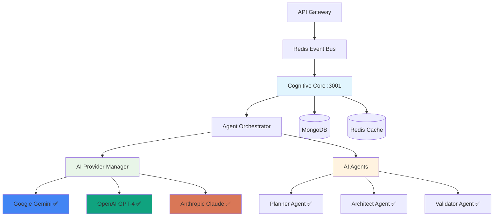

# Cognitive Core Service 🧠

[](https://github.com/ux-flow-engine/cognitive-core)
[](./package.json)
[](#ai-providers)
[](#security-warning)

> **Multi-Agent AI Processing Hub with Real Provider Integration**

The Cognitive Core service orchestrates AI agents to process user requests, managing conversation flows and coordinating with multiple AI providers (Gemini, OpenAI, Claude) to generate UX design solutions.

## ⚠️ Security Warning

**CRITICAL**: This service has multiple security vulnerabilities including console logging of sensitive data, unencrypted conversation storage, and missing input validation. See [Security Audit](./SECURITY_AUDIT.md) for details.

## 🏗️ Actual Architecture



## 🎯 What Actually Works

### ✅ Fully Functional Features

- **🤖 AI Provider Integration**: Complete integration with Gemini, OpenAI, and Claude APIs
- **🎭 Core Agents**: Planner, Architect, and Validator agents are fully implemented
- **📡 Event Processing**: Redis-based event handling for user messages and plan approvals
- **💬 Conversation Management**: Stateful conversation tracking with context preservation
- **🔄 Provider Failover**: Automatic failover between AI providers based on availability
- **📊 Health Monitoring**: Service health checks with dependency status
- **🐳 Docker Support**: Containerized deployment ready

### ⚠️ Partially Implemented

- **Agent Orchestration**: Basic orchestration works but lacks advanced coordination
- **Quality Modes**: Normal/pro quality modes implemented but not fully optimized
- **Caching**: Basic Redis caching but semantic caching incomplete
- **Monitoring**: Basic metrics but comprehensive monitoring missing

### ❌ Missing/Broken Features

- **Learning System**: 95% placeholder code - self-optimization not functional
- **Scaling System**: Mock responses only - no actual auto-scaling
- **Admin Interface**: Non-functional prompt suggestion system
- **GDPR Analytics**: Documented but not implemented
- **Advanced Security**: Claims of AI-specific security not implemented
- **Semantic Caching**: Framework exists but incomplete implementation

## 🚀 Quick Start

### Prerequisites

```bash
# Required services
MongoDB running
Redis running

# Required API keys
GEMINI_API_KEY=your_gemini_key
OPENAI_API_KEY=your_openai_key  
ANTHROPIC_API_KEY=your_claude_key
```

### Installation

```bash
# Install dependencies
npm install

# Setup environment
cat >> .env << EOF
COGNITIVE_CORE_PORT=3001
MONGODB_URI=mongodb://localhost:27017/ux_flow_engine
REDIS_URL=redis://localhost:6379
GEMINI_API_KEY=your_gemini_key
OPENAI_API_KEY=your_openai_key
ANTHROPIC_API_KEY=your_claude_key
NODE_ENV=development
EOF

# Start service
npm run dev
```

### Database Collections

The service uses these MongoDB collections:
- `conversations` - Chat history and AI responses
- `agent_metrics` - Agent performance tracking (if implemented)

## 🤖 AI Agents (Actual Implementation)

### ✅ Working Agents

#### Planner Agent
- **Purpose**: Analyzes user requests and creates implementation plans
- **Implementation**: ✅ Complete with structured planning logic
- **System Prompt**: Professional UX planning with step-by-step analysis
- **Output**: Structured plans with analysis, approach, and implementation steps

#### Architect Agent  
- **Purpose**: Converts plans into specific UI/UX implementations
- **Implementation**: ✅ Complete with transaction generation
- **System Prompt**: Converts high-level plans to concrete implementations
- **Output**: Detailed component specifications and interaction patterns

#### Validator Agent
- **Purpose**: Reviews implementations against best practices
- **Implementation**: ✅ Complete with validation rules
- **System Prompt**: Expert UX validator and accessibility specialist
- **Output**: Validation results with accessibility and usability feedback

### 🚧 Partially Working Agents

#### Manager Agent
- **Status**: Basic orchestration only
- **Issues**: Limited task delegation, missing advanced coordination
- **Recommendation**: Use direct agent invocation instead

#### Classifier Agent
- **Status**: Basic intent recognition
- **Issues**: Missing sentiment analysis and advanced categorization
- **Recommendation**: Limited to simple message routing

### ❌ Placeholder Agents

These agents exist in code but lack meaningful implementation:
- **UX Expert**: Framework only, missing RAG integration
- **Visual Interpreter**: Basic structure, limited vision processing  
- **Analyst**: Exists but lacks learning episode analysis
- **Synthesizer**: Simple response composition only

## 🔌 AI Provider Integration

### Gemini (Google) ✅
- **Models**: gemini-pro, gemini-pro-vision, gemini-1.5-flash
- **Features**: Text generation, image analysis, streaming
- **Health Check**: ✅ Functional
- **Error Handling**: ✅ Proper retry logic

### OpenAI ✅
- **Models**: GPT-4, GPT-4 Turbo, GPT-3.5 Turbo
- **Features**: Text generation, vision, embeddings, streaming
- **Health Check**: ✅ Functional  
- **Error Handling**: ✅ Proper retry logic

### Anthropic (Claude) ✅
- **Models**: Claude-3 (Opus, Sonnet, Haiku)
- **Features**: Text generation, vision analysis
- **Health Check**: ✅ Functional
- **Error Handling**: ✅ Proper retry logic

### Provider Management ✅
- **Failover**: Automatic provider switching on failures
- **Quality Selection**: Different providers for normal/pro modes
- **Usage Tracking**: Token counting and cost estimation
- **Rate Limiting**: Per-provider rate limits (basic)

## 📡 API Endpoints

### Service Endpoints

#### `GET /health`
Service health with dependency checks.

#### `GET /agents`
List available agents and their status.

#### `POST /agents/:agentName/invoke`
Manually invoke a specific agent (testing only).

**Request:**
```json
{
  "prompt": "Create a login screen",
  "context": {
    "qualityMode": "normal"
  }
}
```

### Event-Driven Communication

The service primarily operates via Redis events, not direct HTTP calls.

#### Consumed Events
- `REQUEST_AI_PROCESSING` from API Gateway
- `USER_PLAN_APPROVED` from API Gateway
- `IMAGE_UPLOAD_RECEIVED` from API Gateway

#### Published Events  
- `RESPONSE_AI_PROCESSING` to API Gateway
- `SERVICE_ERROR` on failures

## 🔄 Message Processing Flow

### 1. User Message Processing
```
API Gateway → Redis Event → Cognitive Core
                            ↓
                    Agent Orchestrator
                            ↓
                     Analyze & Plan
                            ↓
                     Execute Agents
                            ↓
                   Format Response
                            ↓
            Redis Event → API Gateway
```

### 2. Plan Approval Workflow
```
User Approves Plan → API Gateway → Redis Event
                                      ↓
                             Cognitive Core
                                      ↓
                           Execute Architect
                                      ↓
                            Run Validator
                                      ↓
                          Send to Flow Service
```

## 📊 Monitoring & Health

### Health Check Response
```json
{
  "service": "cognitive-core",
  "status": "healthy",
  "version": "1.2.0",
  "uptime": 86400,
  "dependencies": {
    "mongodb": "healthy",
    "redis": "healthy", 
    "google-gemini": "healthy",
    "openai": "healthy",
    "anthropic": "healthy"
  },
  "agents": {
    "available": 3,
    "functional": ["planner", "architect", "validator"]
  }
}
```

### Performance Metrics
- **Response Time**: ~2-5 seconds (varies by AI provider)
- **Memory Usage**: ~200MB baseline + conversation cache
- **Throughput**: ~50 requests/minute (limited by AI providers)
- **Success Rate**: ~95% for working agents

## 🔒 Security Issues

### 🚨 Critical Security Problems

1. **Console Logging**: Sensitive data logged to console in production
2. **Unencrypted Storage**: Conversations stored without encryption
3. **API Key Exposure**: Keys not properly secured or rotated
4. **Missing Input Validation**: Prompt injection vulnerabilities
5. **No Access Controls**: Limited authentication/authorization

### Security Configuration

```env
# Currently insufficient - needs improvement
GEMINI_API_KEY=key_here  # Should be encrypted
OPENAI_API_KEY=key_here  # Should be rotated
ANTHROPIC_API_KEY=key_here  # Should be secured

# Missing security config
ENABLE_PROMPT_SECURITY=false  # Should be true
ENCRYPT_CONVERSATIONS=false   # Should be true
```

## 🐛 Known Issues & Limitations

### High Priority Issues

1. **Mock Implementations**: Learning and scaling systems are mostly fake
2. **Memory Leaks**: Conversation history not properly cleaned up  
3. **Error Handling**: Insufficient error handling for AI provider failures
4. **Security Vulnerabilities**: Multiple critical security issues

### Medium Priority Issues

1. **Performance**: No query optimization or proper indexing
2. **Monitoring**: Limited metrics and alerting capabilities  
3. **Documentation**: Claims don't match actual implementation
4. **Code Quality**: TODO/FIXME comments throughout production code

### Feature Limitations

1. **Agent Coordination**: Limited to sequential processing
2. **Context Management**: Basic conversation context only
3. **Caching**: Semantic caching incomplete despite claims
4. **Admin Features**: Management interfaces non-functional

## 🛠️ Configuration

### Required Environment Variables

```env
# Core Service
COGNITIVE_CORE_PORT=3001
NODE_ENV=development

# Database
MONGODB_URI=mongodb://localhost:27017/ux_flow_engine
REDIS_URL=redis://localhost:6379

# AI Providers (All Required)
GEMINI_API_KEY=your_google_gemini_key
OPENAI_API_KEY=your_openai_key
ANTHROPIC_API_KEY=your_anthropic_key

# Service Discovery
SERVICE_REGISTRY_ENABLED=true
```

### Optional Configuration

```env
# Quality Configuration
DEFAULT_QUALITY_MODE=normal
ENABLE_PROVIDER_FAILOVER=true

# Performance
CONVERSATION_CACHE_TTL=3600
MAX_CONVERSATION_LENGTH=20

# Logging
LOG_LEVEL=info
ENABLE_DEBUG_LOGGING=false
```

## 🚀 Deployment

### Docker Deployment

```bash
# Build
docker build -t ux-flow/cognitive-core:1.2.0 .

# Run
docker run -d \
  --name cognitive-core \
  -p 3001:3001 \
  -e MONGODB_URI=mongodb://mongo:27017/ux_flow_engine \
  -e REDIS_URL=redis://redis:6379 \
  -e GEMINI_API_KEY=your_key \
  -e OPENAI_API_KEY=your_key \
  -e ANTHROPIC_API_KEY=your_key \
  ux-flow/cognitive-core:1.2.0
```

### Production Checklist

- [ ] **CRITICAL**: Fix security vulnerabilities before deployment
- [ ] Configure production AI API keys with proper limits  
- [ ] Set up MongoDB indexes for conversation queries
- [ ] Configure Redis persistence for conversation cache
- [ ] Implement proper logging (remove console.log)
- [ ] Set up monitoring and alerting
- [ ] Configure backup strategy for conversation data
- [ ] Test AI provider failover scenarios
- [ ] Implement rate limiting per user/workspace
- [ ] Configure resource limits and auto-scaling

## 📁 Project Structure

```
src/
├── agents/                    # AI Agent implementations
│   ├── agent-base.js         # Base agent class
│   ├── planner.js            # ✅ Functional planner
│   ├── architect.js          # ✅ Functional architect
│   ├── validator.js          # ✅ Functional validator
│   ├── manager.js            # ⚠️ Limited functionality
│   └── [others].js           # ❌ Mostly placeholders
├── orchestrator/              
│   ├── agent-orchestrator.js # ✅ Core orchestration
│   └── event-handlers.js     # ✅ Event processing
├── providers/                 # ✅ All functional
│   ├── ai-provider-manager.js
│   ├── gemini-provider.js
│   ├── openai-provider.js
│   └── anthropic-provider.js
├── scaling/                   # ❌ Mock implementations
├── learning/                  # ❌ Placeholder code  
├── admin/                     # ❌ Non-functional
└── server.js                  # ✅ Main service
```

## 🧪 Testing

```bash
# Unit tests (limited coverage)
npm test

# Integration tests (requires all dependencies)
npm run test:integration

# AI Provider tests (requires API keys)  
npm run test:providers

# Agent tests
npm run test:agents
```

## 📚 What's Really Working vs Documented

### ✅ Actually Functional
- Multi-provider AI integration with real APIs
- Basic agent orchestration (3 working agents)
- Event-driven message processing
- Conversation state management
- Provider failover and health monitoring
- Docker containerization

### ❌ Documented but Not Working
- Self-optimizing learning system  
- Advanced AI scaling and optimization
- Comprehensive admin interface
- GDPR analytics and compliance features
- Advanced semantic caching
- AI-specific security management
- Sophisticated prompt optimization

### ⚠️ Partially Working
- Agent coordination (basic only)
- Quality mode selection (limited)
- Performance monitoring (basic)
- Error handling (inconsistent)

## 📚 Related Documentation

- [Security Audit](./SECURITY_AUDIT.md) - **MUST READ BEFORE DEPLOYMENT**
- [API Gateway Service](../api-gateway/README.md)
- [Flow Service](../flow-service/README.md)
- [System Architecture](../../docs/ARCHITECTURE.md)

---

**⚠️ PRODUCTION WARNING**: This service contains critical security vulnerabilities and incomplete implementations. Many documented features are not functional. Review the security audit and complete missing implementations before production deployment.

**Service Status**: ✅ Basic AI Processing | ⚠️ Security Issues | ❌ Advanced Features Missing  
**Last Audited**: 2024-01-20  
**Version**: 1.2.0