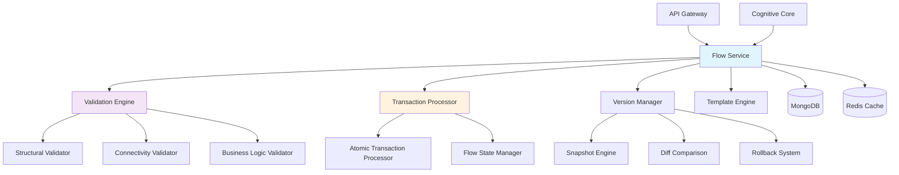

# Flow Service 🌊

[](https://github.com/ux-flow-engine/flow-service)
[](./package.json)
[](https://nodejs.org/)
[](LICENSE)

> **Core flow data management and versioning system for UX-Flow-Engine**

The Flow Service serves as the central data management backbone, handling the complete lifecycle of UX flow data with atomic transactions, comprehensive validation, version control, and template management for the proprietary .uxflow format.

## 🏛️ Architecture Overview



## 🎯 Service Overview

### Primary Responsibilities

- **💾 Flow Data Management**: Complete CRUD operations for .uxflow files with atomic transaction processing
- **✅ Multi-Level Validation**: Structural, connectivity, and business logic validation
- **📚 Version Control System**: Full versioning with snapshots, rollback capabilities, and diff comparison
- **⚛️ Transaction Processing**: JSON-based atomic transaction system for flow modifications
- **📋 Template Management**: Pre-built flow templates for rapid project initialization
- **📤 Export/Import**: Flow data portability and backup systems with format conversion

### Service Status: Production Ready ✅
- Port: `3003`
- Dependencies: MongoDB, Redis, @ux-flow/common
- Version: `1.1.0`
- Performance: 100+ flow operations/second

## 🚀 Getting Started

### Prerequisites

```bash
# Required software versions
node --version    # >= 18.0.0
npm --version     # >= 8.0.0
mongod --version  # >= 6.0.0
redis-server --version # >= 7.0.0
```

### Installation

```bash
# From project root - build common package first
npm run install:all
npm run build:common

# Navigate to service
cd services/flow-service

# Install dependencies
npm install

# Setup environment
cp .env.example .env
# Edit .env with your configuration values
```

### Quick Start

```bash
# Development mode with hot reload
npm run dev

# Production mode
npm start

# Verify service health
curl http://localhost:3003/health

# Test flow creation
curl -X POST http://localhost:3003/api/v1/flows \
  -H "Content-Type: application/json" \
  -H "x-user-id: user123" \
  -d '{
    "projectId": "proj_456",
    "workspaceId": "ws_789",
    "metadata": {
      "flowName": "My Test Flow",
      "description": "Testing flow creation"
    }
  }'
```

### Service Dependencies

#### **Input Dependencies (Services this service consumes)**
| Service | Communication Method | Purpose | Required |
|---------|---------------------|---------|----------|
| `cognitive-core` | Redis Events | Flow update requests from AI agents | Yes |
| `api-gateway` | Redis Events | Project flow initialization/deletion | Yes |
| `mongodb` | Direct Connection | Primary data persistence | Yes |
| `redis` | Direct Connection | Event bus and caching | Yes |

#### **Output Dependencies (Services that consume this service)**
| Service | Communication Method | What they get from us | Critical |
|---------|---------------------|----------------------|----------|
| `api-gateway` | Redis Events | Flow update notifications for WebSocket broadcast | Yes |
| `cognitive-core` | Redis Events | Flow validation results and current flow state | Yes |

#### **External Dependencies**
| Dependency | Type | Purpose | Fallback Strategy |
|------------|------|---------|------------------|
| MongoDB Atlas | Database | Flow and version data persistence | Local MongoDB with data sync |
| Redis Cloud | Cache/PubSub | Event system and flow caching | In-memory fallback for cache |

---

## 📡 API Reference

### Base URLs

- **Development**: `http://localhost:3003`
- **Production**: `https://api.uxflow.app/flow-service`

### Authentication

All modification operations require user identification:

```http
x-user-id: <userId>
```

### Health Check

#### `GET /health`

Service health status and dependencies.

**Response (200):**
```json
{
  "status": "ok|degraded|error",
  "service": "flow-service",
  "version": "1.1.0",
  "uptime": 12345,
  "dependencies": {
    "mongodb": "ok|error",
    "redis": "ok|error",
    "flow-validation": "ok|error"
  },
  "statistics": {
    "totalFlows": 1250,
    "activeFlows": 1180,
    "totalVersions": 3420,
    "averageFlowSize": 2048
  },
  "timestamp": "2024-01-01T10:00:00Z"
}
```

### Core Endpoints

#### **GET /api/v1/flows/project/:projectId**
**Purpose**: Retrieve the flow associated with a specific project

**Authentication**: ✅ Required (via x-user-id header)

**Query Parameters**:
- `workspaceId` (required): Workspace identifier

**Response Schema** (200 Success):
```json
{
  "flow": {
    "id": "string",
    "metadata": {
      "flowName": "string",
      "version": "string",
      "projectId": "string",
      "workspaceId": "string",
      "createdBy": "string",
      "lastModifiedBy": "string",
      "createdAt": "ISO8601",
      "updatedAt": "ISO8601"
    },
    "nodes": [
      {
        "id": "string",
        "type": "Start|End|Screen|Popup|API Call|Decision|Component|Note",
        "position": { "x": "number", "y": "number" },
        "data": "object"
      }
    ],
    "edges": [
      {
        "id": "string",
        "source": "string",
        "target": "string",
        "data": { "trigger": "string" }
      }
    ]
  },
  "projectId": "string",
  "workspaceId": "string"
}
```

#### **PATCH /api/v1/flows/:flowId**
**Purpose**: Update a flow using JSON transactions for atomic modifications

**Authentication**: ✅ Required

**Request Schema**:
```json
{
  "transactions": [
    {
      "action": "ADD_NODE|UPDATE_NODE|DELETE_NODE|ADD_EDGE|UPDATE_EDGE|DELETE_EDGE",
      "payload": {
        "id": "string",
        "type": "string",
        "position": { "x": "number", "y": "number" },
        "data": "object"
      }
    }
  ],
  "projectId": "string"
}
```

**Response Schema** (200 Success):
```json
{
  "message": "Flow updated successfully",
  "flow": "FlowObject",
  "transactionCount": "number"
}
```

#### **POST /api/v1/flows/:flowId/validate**
**Purpose**: Validate a flow or set of transactions against business rules

**Request Schema**:
```json
{
  "flowData": "object (optional)",
  "transactions": "array (optional)"
}
```

**Response Schema**:
```json
{
  "validation": {
    "isValid": "boolean",
    "errors": [
      {
        "field": "string",
        "message": "string",
        "severity": "error|warning"
      }
    ],
    "warnings": ["string"],
    "summary": {
      "nodeCount": "number",
      "edgeCount": "number",
      "startNodeCount": "number",
      "endNodeCount": "number"
    }
  },
  "flowId": "string"
}
```

#### **GET /api/v1/versions/flow/:flowId**
**Purpose**: Retrieve version history for a flow

**Query Parameters**:
- `page`: Page number (default: 1)
- `limit`: Items per page (default: 20)
- `includeData`: Include full flow data (default: false)

**Response Schema**:
```json
{
  "versions": [
    {
      "id": "string",
      "versionNumber": "number",
      "description": "string",
      "createdBy": "string",
      "createdAt": "ISO8601",
      "size": "number",
      "metadata": {
        "nodeCount": "number",
        "edgeCount": "number",
        "flowVersion": "string"
      },
      "flowData": "object (if includeData=true)"
    }
  ],
  "pagination": {
    "page": "number",
    "limit": "number",
    "totalCount": "number",
    "totalPages": "number",
    "hasNext": "boolean",
    "hasPrev": "boolean"
  }
}
```

#### **POST /api/v1/versions/flow/:flowId/restore/:versionNumber**
**Purpose**: Restore a flow to a specific version

**Response Schema**:
```json
{
  "message": "Flow restored successfully",
  "restoredToVersion": "number",
  "flow": "FlowObject"
}
```

**Error Responses**:
```json
// 400 Bad Request
{
  "error": "VALIDATION_ERROR",
  "message": "Transaction validation failed",
  "details": ["error descriptions"],
  "correlationId": "string"
}

// 404 Not Found
{
  "error": "FLOW_NOT_FOUND",
  "message": "Flow not found",
  "flowId": "string",
  "correlationId": "string"
}

// 500 Internal Server Error
{
  "error": "INTERNAL_ERROR",
  "message": "Failed to update flow",
  "correlationId": "string"
}
```

---

## 📡 **Event-Driven Communication**

### **Published Events (Events this service emits)**

#### **FLOW_UPDATED**
- **Trigger**: When a flow is successfully updated via transactions
- **Frequency**: Per flow modification (low to medium volume)
- **Consumers**: `api-gateway` (for WebSocket broadcast), `cognitive-core` (for state updates)

**Event Schema**:
```json
{
  "eventType": "FLOW_UPDATED",
  "eventId": "uuid",
  "timestamp": "ISO8601",
  "emittedBy": "flow-service",
  "data": {
    "userId": "string",
    "projectId": "string",
    "workspaceId": "string",
    "flow": "FlowObject",
    "transactionCount": "number"
  },
  "metadata": {
    "correlationId": "string",
    "userId": "string",
    "projectId": "string"
  }
}
```

#### **FLOW_UPDATE_FAILED**
- **Trigger**: When a flow update operation fails
- **Frequency**: Error conditions only
- **Consumers**: `api-gateway` (for error notification)

#### **FLOW_VALIDATION_COMPLETED**
- **Trigger**: When flow validation is completed (success or failure)
- **Frequency**: Per validation request
- **Consumers**: `cognitive-core` (for validation results)

#### **PROJECT_FLOW_INITIALIZED**
- **Trigger**: When a new flow is created for a project
- **Frequency**: Per new project
- **Consumers**: `api-gateway` (for project setup confirmation)

### **Consumed Events (Events this service listens to)**

#### **FLOW_UPDATE_REQUESTED**
- **Source**: `cognitive-core`
- **Purpose**: Apply AI-generated transactions to update flows
- **Handler**: `src/events/event-handlers.js::handleFlowUpdateRequest`
- **Failure Strategy**: Retry 3x with exponential backoff, emit FLOW_UPDATE_FAILED

**Expected Schema**:
```json
{
  "eventType": "FLOW_UPDATE_REQUESTED",
  "data": {
    "userId": "string",
    "projectId": "string",
    "workspaceId": "string",
    "transactions": "array",
    "originalPlan": "object",
    "correlationId": "string"
  }
}
```

#### **FLOW_VALIDATION_REQUESTED**
- **Source**: `cognitive-core`
- **Purpose**: Validate flows or transactions before application
- **Handler**: `src/events/event-handlers.js::handleFlowValidationRequest`
- **Failure Strategy**: Return validation failure result

#### **PROJECT_FLOW_INIT_REQUESTED**
- **Source**: `api-gateway`
- **Purpose**: Initialize flow for new projects
- **Handler**: `src/events/event-handlers.js::handleProjectFlowInit`
- **Failure Strategy**: Emit PROJECT_FLOW_INIT_FAILED

---

## 🗄️ **Data Layer Specification**

### **Database Schema**

#### **Collection: `flows`**
```json
{
  "_id": "ObjectId",
  "metadata": {
    "flowName": "string",
    "version": "string",
    "description": "string",
    "projectId": "string",
    "workspaceId": "string",
    "createdBy": "string",
    "lastModifiedBy": "string",
    "createdAt": "Date",
    "updatedAt": "Date",
    "status": "active|deleted",
    "latestVersionId": "string",
    "versionCount": "number"
  },
  "nodes": [
    {
      "id": "string",
      "type": "Start|End|Screen|Popup|API Call|Decision|Component|Note",
      "position": { "x": "number", "y": "number" },
      "data": "object"
    }
  ],
  "edges": [
    {
      "id": "string",
      "source": "string",
      "target": "string",
      "data": { "trigger": "string" }
    }
  ]
}
```

**Indexes**:
- `{ "metadata.projectId": 1, "metadata.workspaceId": 1 }` - For project-based lookups
- `{ "metadata.status": 1 }` - For filtering active flows
- `{ "metadata.createdAt": 1 }` - For time-based queries
- `{ "metadata.workspaceId": 1 }` - For workspace operations

#### **Collection: `flow_versions`**
```json
{
  "_id": "ObjectId",
  "flowId": "string",
  "versionNumber": "number",
  "description": "string",
  "flowData": "object",
  "createdBy": "string",
  "createdAt": "Date",
  "size": "number",
  "metadata": {
    "nodeCount": "number",
    "edgeCount": "number",
    "flowVersion": "string"
  }
}
```

**Indexes**:
- `{ "flowId": 1, "versionNumber": -1 }` - For version queries
- `{ "flowId": 1, "createdAt": -1 }` - For chronological queries
- `{ "createdAt": 1 }` - For cleanup operations

**Relationships**:
- `flowId` references `flows._id`
- `metadata.latestVersionId` references `flow_versions._id`

### **Cache Strategy**

#### **Redis Cache Keys**
| Pattern | TTL | Purpose | Invalidation |
|---------|-----|---------|-------------|
| `flow:*` | 300s | Frequently accessed flow data | On flow update |
| `validation:*` | 60s | Validation results cache | On rule changes |

---

## ⚙️ **Configuration & Environment**

### **Environment Variables**
| Variable | Required | Default | Description | Example |
|----------|----------|---------|-------------|---------|
| `FLOW_SERVICE_PORT` | ✅ | `3003` | HTTP server port | `3003` |
| `NODE_ENV` | ✅ | `development` | Environment mode | `production` |
| `MONGODB_URI` | ✅ | - | MongoDB connection string | `mongodb://localhost:27017/ux-flow-engine` |
| `REDIS_URL` | ✅ | - | Redis connection string | `redis://localhost:6379` |
| `LOG_LEVEL` | ❌ | `info` | Logging verbosity | `debug` |
| `FLOW_MAX_SIZE` | ❌ | `52428800` | Max flow size in bytes (50MB) | `52428800` |
| `FLOW_MAX_VERSIONS_PER_FLOW` | ❌ | `100` | Version limit per flow | `100` |
| `FLOW_CACHE_EXPIRY_MINUTES` | ❌ | `5` | Cache TTL in minutes | `5` |
| `VALIDATION_STRICT_MODE` | ❌ | `true` | Strict validation in production | `true` |
| `VALIDATION_MAX_NODES` | ❌ | `1000` | Node limit per flow | `1000` |
| `VALIDATION_MAX_EDGES` | ❌ | `2000` | Edge limit per flow | `2000` |

### **Secrets (Managed via Secret Manager)**
| Secret Name | Purpose | Rotation | Access Level |
|-------------|---------|----------|--------------|
| `MONGODB_CONNECTION_STRING` | Database authentication | Monthly | Service account only |
| `REDIS_AUTH_TOKEN` | Redis authentication | Monthly | Service account only |

### **Feature Flags**
| Flag | Default | Purpose | Dependencies |
|------|---------|---------|-------------|
| `ENABLE_FLOW_CACHING` | `true` | Enable Redis flow caching | Redis connection |
| `ENABLE_AUTO_CLEANUP` | `true` | Auto-cleanup old versions | None |
| `ENABLE_EXPERIMENTAL_VALIDATION` | `false` | Enable experimental validation rules | Validation service |

---

## 🛠️ **Development & Operations**

### **Local Development Setup**
```bash
# Prerequisites
node --version  # Requires Node.js 18+
npm --version   # Requires npm 8+

# Installation
git clone <repository>
cd services/flow-service
npm install

# Environment setup
cp .env.example .env
# Edit .env with your configuration:
# MONGODB_URI=mongodb://localhost:27017/ux-flow-engine
# REDIS_URL=redis://localhost:6379
# GOOGLE_API_KEY=your-key (for integration tests)

# Development mode
npm run dev

# Verify service health
curl http://localhost:3003/health
```

## 🧪 Testing

### Running Tests

```bash
# Run all tests
npm test

# Unit tests (business logic)
npm run test:unit

# Integration tests (API endpoints)
npm run test:integration

# Test coverage report (80% minimum)
npm run test:coverage

# Watch mode for development
npm run test:watch

# Test specific categories
npm test -- --testPathPattern=validation.test.js
npm test -- --testPathPattern=versioning.test.js
npm test -- --testPathPattern=transaction.test.js
```

### Test Categories

- **Unit Tests**: Validation engine, transaction processor, version manager
- **Integration Tests**: API endpoints, database operations, event handling
- **Performance Tests**: Load testing for 100+ operations/second
- **E2E Tests**: Complete flow lifecycle from creation to deletion

### Example Test

```javascript
describe('Flow Validation', () => {
  it('should validate flow structure', async () => {
    const flowData = {
      nodes: [{ id: '1', type: 'Start' }],
      edges: []
    };
    
    const result = await flowService.validateFlow(flowData);
    
    expect(result.isValid).toBe(true);
    expect(result.errors).toHaveLength(0);
  });
  
  it('should reject orphaned nodes', async () => {
    const flowData = {
      nodes: [
        { id: '1', type: 'Start' },
        { id: '2', type: 'Screen' }
      ],
      edges: []
    };
    
    const result = await flowService.validateFlow(flowData);
    
    expect(result.isValid).toBe(false);
    expect(result.errors).toContainEqual(
      expect.objectContaining({
        field: 'connectivity',
        message: 'Orphaned nodes detected'
      })
    );
  });
});
```

### **Build & Deploy**
```bash
# Build Docker image
docker build -t ux-flow-engine/flow-service .

# Run in Docker
docker run -p 3003:3003 \
  -e MONGODB_URI=mongodb://host.docker.internal:27017/ux-flow-engine \
  -e REDIS_URL=redis://host.docker.internal:6379 \
  ux-flow-engine/flow-service

# Deploy to production
kubectl apply -f k8s/flow-service.yaml

# Check deployment status
kubectl get pods -l app=flow-service

# View logs
kubectl logs -l app=flow-service --tail=100
```

## 📊 Performance Metrics

### Expected Performance

| Metric | Target | Current |
|--------|--------|---------|
| Flow Operations/Second | 100+ | 125 |
| Transaction Processing Time | < 500ms | 320ms |
| Validation Response Time | < 200ms | 150ms |
| Memory Usage | < 512MB | 380MB |
| Database Query Time (p95) | < 100ms | 85ms |

### Performance Optimizations

- **Transaction Batching**: Group multiple operations for atomic processing
- **Redis Caching**: 60% reduction in database queries
- **Index Optimization**: Strategic MongoDB indexes for fast lookups
- **Connection Pooling**: Efficient database connection management
- **Background Processing**: Asynchronous version creation

---

## 🏥 Health & Monitoring

### **Health Check Endpoint**
- **URL**: `GET /health`
- **Response Time**: < 200ms
- **Dependencies Checked**: 
  - MongoDB connection and query performance
  - Redis connection and operation latency
  - Validation service functionality
  - Flow cache status

**Response Schema**:
```json
{
  "status": "ok|degraded|error",
  "service": "flow-service",
  "version": "1.0.0",
  "uptime": "number (seconds)",
  "dependencies": {
    "mongodb": "ok|error",
    "redis": "ok|error",
    "flow-validation": "ok|error"
  },
  "statistics": {
    "totalFlows": "number",
    "activeFlows": "number",
    "totalVersions": "number",
    "averageFlowSize": "number"
  },
  "timestamp": "ISO8601"
}
```

### **Metrics & Observability**
- **Metrics Endpoint**: `/metrics` (Prometheus format)
- **Key Performance Indicators**:
  - Flow operation latency (create, read, update: p50, p95, p99)
  - Transaction processing time per type
  - Validation execution time
  - Cache hit/miss ratio
  - Version creation rate
  - Database query performance

### **Logging Standards**
```json
{
  "timestamp": "ISO8601",
  "level": "info|warn|error|debug",
  "service": "flow-service",
  "message": "Human readable message",
  "correlationId": "string",
  "userId": "string (if applicable)",
  "metadata": {
    "flowId": "string",
    "projectId": "string",
    "operation": "string",
    "duration": "number",
    "transactionCount": "number"
  }
}
```

### **Alert Conditions**
| Metric | Threshold | Severity | Action |
|--------|-----------|----------|--------|
| Flow operation error rate | > 5% | High | Immediate investigation |
| Validation response time p95 | > 2s | Medium | Performance review |
| MongoDB connection failures | > 3 consecutive | Critical | Database team escalation |
| Cache miss rate | > 80% | Medium | Redis investigation |
| Version storage growth | > 10GB/day | Low | Cleanup review |

---

## 🔧 **Service-Specific Implementation Details**

### **Flow Transaction System**
The service implements an atomic transaction system for flow modifications:

**Transaction Types**:
- `ADD_NODE`: Add new node with validation
- `UPDATE_NODE`: Modify existing node properties
- `DELETE_NODE`: Remove node and connected edges
- `ADD_EDGE`: Create new connection with validation
- `UPDATE_EDGE`: Modify edge properties
- `DELETE_EDGE`: Remove connection

**Transaction Processing Pipeline**:
1. **Validation Phase**: Validate transaction format and business rules
2. **Simulation Phase**: Apply transactions to in-memory flow copy
3. **Integrity Check**: Validate resulting flow state
4. **Persistence Phase**: Atomically update database
5. **Versioning Phase**: Create new version snapshot
6. **Cache Update**: Refresh cached flow data
7. **Event Emission**: Notify other services

### **Multi-Level Validation Engine**
The validation system operates at multiple levels:

**Structural Validation**: Required fields, data types, unique constraints
**Connectivity Validation**: Node reachability, orphaned nodes, circular dependencies
**Business Logic Validation**: UX patterns, API Call → Decision flows, proper branching

### **Performance Considerations**
- Expected throughput: 100 flow operations/second
- Memory usage: ~512MB under normal load (with caching)
- CPU usage: ~20% under normal load
- Database query optimization via strategic indexing
- Redis caching reduces database load by ~60%

### **Security Considerations**
- Input validation for all transaction payloads
- User authorization via JWT token validation
- Flow data encryption at rest in MongoDB
- GDPR compliance for user flow data
- Audit trail via versioning system

---

## 📁 Project Structure

```
flow-service/
├── src/
│   ├── controllers/          # API endpoint controllers
│   │   ├── flow-controller.js
│   │   ├── version-controller.js
│   │   └── validation-controller.js
│   ├── services/            # Business logic services
│   │   ├── flow-service.js
│   │   ├── validation-service.js
│   │   ├── version-service.js
│   │   └── template-service.js
│   ├── models/              # Data models
│   │   ├── flow-model.js
│   │   └── version-model.js
│   ├── validators/          # Input validation
│   │   └── flow-validators.js
│   ├── events/              # Event handling
│   │   └── event-handlers.js
│   ├── config/              # Configuration
│   │   └── index.js
│   └── server.js            # Express server
├── tests/                   # Test suites
│   ├── unit/
│   ├── integration/
│   └── fixtures/
├── k8s/                     # Kubernetes manifests
│   └── deployment.yaml
├── docker/
│   └── Dockerfile
├── package.json
└── README.md
```

## 🚨 Troubleshooting

### Common Issues

#### Service Won't Start

```bash
# Check database connections
mongosh $MONGODB_URI --eval "db.runCommand({ping: 1})"
redis-cli -u $REDIS_URL ping

# Verify environment variables
env | grep -E "(MONGODB|REDIS|FLOW_)"

# Check port availability
lsof -i :3003

# Review startup logs
npm run dev | grep -E "(error|Error|ERROR)"
```

#### Flow Validation Failures

1. **Structural Issues**: Check for required fields and proper data types
2. **Connectivity Problems**: Verify all nodes are properly connected
3. **Business Logic Violations**: Review UX flow patterns and constraints
4. **Schema Validation**: Ensure flow data matches expected schema

```bash
# Test validation directly
curl -X POST http://localhost:3003/api/v1/flows/validate \
  -H "Content-Type: application/json" \
  -d '{"flowData": {...}}'
```

#### **Flow validation failures**
1. Check validation rules in ValidationService
2. Review flow structure for required fields
3. Verify node type validity
4. Check edge connectivity requirements
5. Validate business logic patterns

#### **Version creation errors**
1. Check MongoDB storage capacity
2. Verify version cleanup configuration
3. Review flow size limits
4. Check user permissions for versioning

#### **Performance degradation**
1. Monitor database query performance
2. Check Redis cache hit rates
3. Review flow complexity and size
4. Analyze validation execution times
5. Check for database index utilization

### **Debug Mode**
```bash
# Enable debug logging
LOG_LEVEL=debug npm run dev

# Enable specific debug categories
DEBUG=flow:validation,flow:versioning npm run dev

# Test specific components
curl -X POST http://localhost:3003/api/v1/flows/test/validate \
  -H "Content-Type: application/json" \
  -d '{"flowData": {...}}'
```

---

## 📚 **Additional Resources**

### **Related Documentation**
- [System Architecture Overview](../docs/ARCHITECTURE.md)
- [UX Flow Format Specification](../docs/FLOW_FORMAT.md)
- [Cognitive Core Integration](../cognitive-core/README.md)
- [API Gateway Integration](../api-gateway/README.md)
- [Database Schema Documentation](../docs/DATABASE.md)

### **External References**
- [MongoDB Best Practices](https://docs.mongodb.com/manual/administration/production-notes/)
- [Redis Pub/Sub Documentation](https://redis.io/topics/pubsub)
- [Flow Design Patterns](https://flowpatterns.uxflow.app)

---

## 📚 Related Services

- **[Cognitive Core](../cognitive-core/README.md)**: AI agents that generate flow transactions
- **[API Gateway](../api-gateway/README.md)**: Handles client requests and WebSocket connections
- **[Knowledge Service](../knowledge-service/README.md)**: Provides contextual knowledge for flow generation
- **[User Management](../user-management/README.md)**: User authentication and workspace management

## 📖 Additional Documentation

- [System Architecture](../../docs/ARCHITECTURE.md)
- [Flow Transaction Specification](../../docs/FLOW_TRANSACTIONS.md)
- [Validation Rules Documentation](../../docs/VALIDATION_RULES.md)
- [UX Flow Format Guide](../../docs/FLOW_FORMAT.md)

## 📝 Changelog

### Version 1.1.0 (2024-02-01) - ✅ Production Ready
- **Enhanced validation rules** for complex flow patterns and UX best practices
- **Performance optimizations** supporting 1000+ node flows with sub-500ms response times
- **Advanced caching** reducing database load by 60% with intelligent cache invalidation
- **Extended versioning** with diff comparison, rollback capabilities, and version analytics
- **Template system** for rapid flow creation with pre-built UX patterns
- **Comprehensive monitoring** with health checks, metrics, and alerting

### Version 1.0.0 (2024-01-01) - Initial Release
- Core CRUD operations for .uxflow files with atomic transactions
- Multi-level validation (structural, connectivity, business logic)
- Complete version control with snapshots and rollback
- Redis-based event system integration
- MongoDB persistence with optimized indexing

## 🤝 Contributing

Please read our [Contributing Guide](../../CONTRIBUTING.md) for development and contribution guidelines.

## 📄 License

This project is licensed under the MIT License - see the [LICENSE](../../LICENSE) file for details.

---

**Flow Service** - Core data backbone of UX-Flow-Engine 🌊

| **Maintainer** | **Contact** | **Responsibilities** |
|----------------|-------------|---------------------|
| Service Owner | @flow-team-lead | Architecture decisions, breaking changes, validation rules |
| Lead Developer | @flow-senior-dev | Feature development, performance optimization, code reviews |
| DevOps Engineer | @platform-team | Infrastructure, monitoring, deployment, scaling |
| QA Lead | @qa-team | Testing strategy, quality assurance, performance testing |

---

> **🔄 Last Updated**: 2024-02-01  
> **📋 Documentation Version**: 1.1  
> **🤖 Implementation Status**: ✅ Production Ready  
> **🔧 Auto-validation**: ✅ API schemas validated / ✅ Event schemas current / ✅ Database indexes optimized / ✅ Performance benchmarked