# ==========================================
# ROOT: README.md
# ==========================================

# UX-Flow-Engine v2.0 🚀

> AI-powered UX Flow Design Engine with Multi-Agent Architecture

**Transform your UX design process with intelligent, conversational flow creation.**

## ✨ What is UX-Flow-Engine?

UX-Flow-Engine is a next-generation tool that combines the power of AI agents with collaborative flow design. Instead of manually drawing flows, you simply describe what you want in natural language, and our AI agents create, validate, and optimize your user experience flows automatically.

### 🎯 Key Features

- **🤖 AI-Powered Design**: Describe flows in natural language, get professional diagrams
- **🧠 Multi-Agent Intelligence**: Specialized AI agents for planning, validation, and optimization  
- **📊 Hierarchical Flow Design**: Global overview with detailed sub-flow drilling
- **👥 Real-time Collaboration**: WebSocket-based live editing and feedback
- **📈 Version Control**: Complete snapshot and rollback capabilities
- **🎨 Persona-Driven Design**: Filter flows by user personas and goals
- **📚 Knowledge-Augmented**: Built-in UX principles and best practices

## 🏗️ Architecture Overview

```
┌─────────────────┐    ┌─────────────────┐    ┌─────────────────┐
│  API Gateway    │    │ Cognitive Core  │    │ Knowledge Base  │
│   (Port 3000)   │────│   (Port 3001)   │────│   (Port 3002)   │
└─────────────────┘    └─────────────────┘    └─────────────────┘
         │                        │                        │
         └────────────────────────┼────────────────────────┘
                                  │
                        ┌─────────────────┐
                        │  Flow Service   │
                        │   (Port 3003)   │
                        └─────────────────┘
```

**Event-Driven Microservices** connected via Redis Pub/Sub with MongoDB persistence.

## 🚀 Quick Start

### Prerequisites
- Node.js ≥ 18.0.0
- MongoDB (local or Atlas)
- Redis (local or cloud)
- Google Gemini API Key

### Installation

```bash
# Clone the repository
git clone https://github.com/your-org/ux-flow-engine.git
cd ux-flow-engine

# Install dependencies for all services
npm run install:all

# Copy environment configuration
cp .env.example .env
# Edit .env with your API keys and database URLs

# Start development environment
npm run dev
```

### Your First Flow

1. Open http://localhost:3000 in your browser
2. Create a new project
3. Tell the AI: *"Create a login flow with email and password"*
4. Review the generated plan
5. Approve and watch your flow come to life! ✨

## 📁 Project Structure

```
ux-flow-engine/
├── 📄 README.md                    # You are here
├── 📄 CONTRIBUTING.md              # Development guidelines
├── 📄 ARCHITECTURE.md              # System architecture details
├── 📄 package.json                 # Root workspace config
├── 📄 docker-compose.yml           # Development environment
│
├── 📁 packages/
│   └── 📁 common/                  # Shared utilities
│       ├── 📁 src/
│       │   ├── 📁 logger/          # Structured logging
│       │   ├── 📁 events/          # Event system
│       │   ├── 📁 database/        # DB clients
│       │   └── 📁 utils/           # Common utilities
│       └── 📄 package.json
│
├── 📁 services/                    # Microservices
│   ├── 📁 api-gateway/             # 🌐 Main API & WebSocket
│   ├── 📁 cognitive-core/          # 🧠 AI Agents Hub
│   ├── 📁 knowledge-service/       # 📚 RAG & Knowledge Base
│   └── 📁 flow-service/            # 📊 Flow Data Management
│
├── 📁 docs/                        # Documentation
├── 📁 scripts/                     # Development scripts
├── 📁 deployment/                  # K8s & Terraform
└── 📁 tests/                      # Integration tests
```

## 🤖 AI Agents

Our multi-agent system consists of specialized AI components:

| Agent | Purpose | When Used |
|-------|---------|-----------|
| **Manager** | Task coordination & planning | Every user request |
| **Planner** | Detailed step-by-step plans | Build requests |
| **Architect** | Flow structure & validation | Plan execution |
| **Classifier** | Intent & sentiment analysis | Message processing |
| **UX Expert** | Design principles & advice | Questions about UX |
| **Synthesizer** | Response composition | All user responses |

## 🔧 Development

### Commands

```bash
# Development
npm run dev                    # Start all services
npm run dev:api-gateway       # Start specific service
npm run health:check          # Check all services

# Testing
npm run test                  # Run all tests
npm run test:integration      # Integration tests
npm run test:coverage         # Coverage report

# Utilities
npm run logs:tail             # Aggregate logs
npm run generate:service      # Create new service
npm run migrate:data          # Data migration
```

### Service Development

Each service is independently developed:

```bash
cd services/cognitive-core
npm run dev          # Hot reload development
npm test            # Service-specific tests
npm run lint:fix    # Code formatting
```

## 🗄️ Data Models

### Flow Structure (.uxflow)
```javascript
{
  "metadata": { "flowName": "Login Flow", "version": "1.0.0" },
  "nodes": [
    { "id": "start", "type": "Start" },
    { "id": "login", "type": "Screen", "data": { ... } }
  ],
  "edges": [
    { "id": "e1", "source": "start", "target": "login" }
  ]
}
```

### Agent Communication
```javascript
{
  "eventType": "USER_MESSAGE_RECEIVED",
  "userId": "user_123",
  "projectId": "proj_456", 
  "message": "Add a forgot password link",
  "timestamp": "2024-01-01T10:00:00Z"
}
```

## 🌍 Environment Configuration

Key environment variables:

```bash
# AI & APIs
GOOGLE_API_KEY=your-gemini-api-key

# Databases  
MONGODB_URI=mongodb://localhost:27017/ux-flow-engine
REDIS_URL=redis://localhost:6379
CHROMADB_URL=http://localhost:8000

# Services
API_GATEWAY_URL=http://localhost:3000
COGNITIVE_CORE_URL=http://localhost:3001

# Security
JWT_SECRET=your-jwt-secret-key
```

## 🚢 Deployment

### Development
```bash
docker-compose up --build
```

### Production (Kubernetes)
```bash
kubectl apply -k deployment/kubernetes/overlays/production
```

### Cloud (Terraform)
```bash
cd deployment/terraform/environments/prod
terraform init && terraform apply
```

## 📊 Monitoring

- **Health Checks**: Each service exposes `/health` endpoint
- **Structured Logging**: JSON format with correlation IDs
- **Metrics**: Prometheus-compatible metrics on `/metrics`
- **Tracing**: OpenTelemetry integration (planned)

## 🤝 Contributing

We welcome contributions! Please see [CONTRIBUTING.md](CONTRIBUTING.md) for guidelines.

### Quick Contribution Setup
```bash
git clone <your-fork>
npm run install:all
npm run dev
# Make changes
npm test
npm run lint:fix
# Create PR
```

## 📜 License

MIT License - see [LICENSE](LICENSE) for details.

## 🆘 Support

- **Documentation**: [docs/](docs/)
- **Issues**: [GitHub Issues](https://github.com/your-org/ux-flow-engine/issues)
- **Discussions**: [GitHub Discussions](https://github.com/your-org/ux-flow-engine/discussions)

---

**Built with ❤️ by the UX-Flow-Engine Team**

# ==========================================
# ROOT: CONTRIBUTING.md
# ==========================================

# Contributing to UX-Flow-Engine 🤝

Thank you for your interest in contributing to UX-Flow-Engine! This document provides guidelines and information for contributors.

## 📋 Table of Contents

- [Code of Conduct](#code-of-conduct)
- [Getting Started](#getting-started)
- [Development Workflow](#development-workflow)
- [Architecture Guidelines](#architecture-guidelines)
- [Code Standards](#code-standards)
- [Testing Requirements](#testing-requirements)
- [Documentation](#documentation)
- [Pull Request Process](#pull-request-process)

## 📜 Code of Conduct

We are committed to providing a welcoming and inclusive environment. Please read and follow our Code of Conduct (coming soon).

## 🚀 Getting Started

### Prerequisites

- **Node.js**: ≥ 18.0.0 (use `nvm` for version management)
- **npm**: ≥ 8.0.0 (comes with Node.js)
- **Git**: Latest version
- **Docker**: For local development environment
- **MongoDB**: Local instance or Atlas connection
- **Redis**: Local instance or cloud connection

### Initial Setup

1. **Fork and Clone**
   ```bash
   git clone https://github.com/YOUR_USERNAME/ux-flow-engine.git
   cd ux-flow-engine
   ```

2. **Install Dependencies**
   ```bash
   npm run install:all
   ```

3. **Environment Configuration**
   ```bash
   cp .env.example .env
   # Edit .env with your configuration
   ```

4. **Verify Setup**
   ```bash
   npm run health:check
   npm test
   ```

## 🔄 Development Workflow

### Branch Strategy

We use **Git Flow** with these branch types:

- `main`: Production-ready code
- `develop`: Integration branch for features
- `feature/feature-name`: New features
- `bugfix/bug-name`: Bug fixes
- `hotfix/critical-fix`: Critical production fixes

### Feature Development Process

1. **Create Feature Branch**
   ```bash
   git checkout develop
   git pull origin develop
   git checkout -b feature/your-feature-name
   ```

2. **Make Changes**
   - Follow [Architecture Guidelines](#architecture-guidelines)
   - Write tests for new functionality
   - Update documentation as needed

3. **Commit Changes**
   ```bash
   # Use conventional commits
   git commit -m "feat(cognitive-core): add new planner agent capability"
   ```

4. **Test Thoroughly**
   ```bash
   npm test                    # Unit tests
   npm run test:integration    # Integration tests
   npm run lint:fix           # Code formatting
   ```

5. **Create Pull Request**
   - Use the PR template
   - Link related issues
   - Request appropriate reviewers

### Conventional Commits

We use [Conventional Commits](https://conventionalcommits.org/) specification:

```
<type>[optional scope]: <description>

[optional body]

[optional footer(s)]
```

**Types:**
- `feat`: New feature
- `fix`: Bug fix
- `docs`: Documentation changes
- `style`: Code style changes (formatting, etc.)
- `refactor`: Code refactoring
- `test`: Adding or updating tests
- `chore`: Maintenance tasks

**Examples:**
```bash
feat(api-gateway): add rate limiting middleware
fix(cognitive-core): resolve agent timeout issue
docs(readme): update installation instructions
test(flow-service): add validation tests
```

## 🏗️ Architecture Guidelines

### Service Structure

Each service follows this structure:
```
services/service-name/
├── src/
│   ├── server.js           # Main entry point
│   ├── routes/             # API routes
│   ├── services/           # Business logic
│   ├── models/             # Data models
│   ├── config/             # Configuration
│   └── utils/              # Service utilities
├── tests/                  # Service tests
├── package.json
├── Dockerfile
└── README.md
```

### Key Principles

1. **Single Responsibility**: Each service has one clear purpose
2. **Event-Driven**: Services communicate via Redis events
3. **Stateless**: Services don't store local state
4. **Health Checks**: Every service exposes `/health`
5. **Structured Logging**: Use the common Logger class
6. **Error Handling**: Graceful error handling with proper logging

### Adding a New Service

Use the generator:
```bash
npm run generate:service -- --name=new-service --port=3004
```

This creates the complete service structure with:
- Basic Express.js setup
- Health check endpoint
- Docker configuration
- Test scaffolding
- Documentation template

### Agent Development

New AI agents must extend `BaseAgent`:

```javascript
import { BaseAgent } from './base-agent.js';

class NewAgent extends BaseAgent {
  async executeTask(input, context) {
    // Agent-specific logic
    const result = await this.callModel(prompt, qualityMode);
    return result;
  }
  
  getTaskDescription(input, context) {
    return `Processing ${input} with NewAgent`;
  }
}
```

## 📝 Code Standards

### ESLint & Prettier

We use ESLint for code quality and Prettier for formatting:

```bash
npm run lint        # Check for issues
npm run lint:fix    # Auto-fix issues
```

### Code Style Guidelines

1. **Use ES6+ Features**: Async/await, destructuring, arrow functions
2. **Descriptive Names**: `getUserFlow()` not `getUF()`
3. **Small Functions**: Max 50 lines per function
4. **Constants**: Use UPPER_CASE for constants
5. **Error Handling**: Always handle Promise rejections

### File Naming

- **Services**: `kebab-case` (e.g., `api-gateway/`)
- **Files**: `kebab-case.js` (e.g., `user-service.js`)
- **Classes**: `PascalCase` (e.g., `class UserService`)
- **Functions**: `camelCase` (e.g., `getUserById()`)
- **Constants**: `UPPER_CASE` (e.g., `MAX_RETRIES`)

## 🧪 Testing Requirements

### Test Structure

```
tests/
├── unit/                   # Unit tests (per service)
├── integration/            # Cross-service tests
├── e2e/                    # End-to-end tests
└── fixtures/               # Test data
```

### Testing Standards

1. **Coverage Requirement**: Minimum 80% test coverage
2. **Test Naming**: Descriptive test names
   ```javascript
   describe('UserService', () => {
     it('should create user with valid email', async () => {
       // Test implementation
     });
   });
   ```

3. **Mocking**: Mock external dependencies
4. **Integration Tests**: Test service interactions
5. **E2E Tests**: Test complete user workflows

### Running Tests

```bash
# All tests
npm test

# Specific service
cd services/cognitive-core && npm test

# With coverage
npm run test:coverage

# Integration tests
npm run test:integration

# Watch mode (development)
npm test -- --watch
```

## 📚 Documentation

### Required Documentation

1. **Service README**: Each service needs a README.md
2. **API Documentation**: OpenAPI/Swagger specs
3. **Architecture Decisions**: Document in `docs/adr/`
4. **Code Comments**: For complex business logic

### Documentation Standards

- Use clear, concise language
- Include code examples
- Keep documentation up-to-date with code changes
- Use Markdown for consistency

### API Documentation

Document all endpoints:

```javascript
/**
 * @route   POST /api/v1/flows
 * @desc    Create a new flow
 * @access  Private
 * @param   {string} name - Flow name
 * @param   {Object} data - Flow data
 * @returns {Object} Created flow
 */
```

## 🔍 Pull Request Process

### PR Checklist

Before submitting a PR, ensure:

- [ ] Code follows style guidelines
- [ ] Tests pass (`npm test`)
- [ ] Coverage meets requirements (≥80%)
- [ ] Documentation updated
- [ ] No merge conflicts
- [ ] PR description follows template
- [ ] Linked to relevant issues

### PR Template

```markdown
## Description
Brief description of changes

## Type of Change
- [ ] Bug fix
- [ ] New feature
- [ ] Breaking change
- [ ] Documentation update

## Testing
- [ ] Unit tests added/updated
- [ ] Integration tests pass
- [ ] Manual testing completed

## Screenshots (if applicable)

## Checklist
- [ ] Code follows style guidelines
- [ ] Self-review completed
- [ ] Documentation updated
```

### Review Process

1. **Automated Checks**: CI/CD pipeline runs tests
2. **Code Review**: At least one reviewer required
3. **Manual Testing**: For UI/UX changes
4. **Approval**: Reviewer approval required
5. **Merge**: Squash and merge to develop

## 🚀 Deployment & Release

### Release Process

1. **Feature Complete**: All features merged to develop
2. **Release Branch**: Create `release/v2.x.x`
3. **Testing**: Comprehensive testing on staging
4. **Documentation**: Update version docs
5. **Merge**: Release branch to main
6. **Tag**: Create version tag
7. **Deploy**: Automated deployment to production

### Hotfix Process

For critical production issues:

1. Create `hotfix/issue-name` from main
2. Fix the issue
3. Test thoroughly
4. Merge to both main and develop
5. Deploy immediately

## 🤔 Getting Help

### Communication Channels

- **GitHub Issues**: Bug reports and feature requests
- **GitHub Discussions**: General questions and ideas
- **Slack**: Real-time development chat (link in issues)

### Common Questions

**Q: How do I add a new AI agent?**
A: Use `npm run generate:agent -- --name=YourAgent` and follow the BaseAgent pattern.

**Q: How do I test WebSocket functionality?**
A: See `tests/integration/websocket.test.js` for examples.

**Q: What's the deployment process?**
A: See `docs/DEPLOYMENT.md` for detailed deployment instructions.

## 🙏 Recognition

Contributors will be recognized in:
- README.md contributors section
- Release notes
- Annual contributor spotlight

Thank you for contributing to UX-Flow-Engine! 🚀

# ==========================================
# DOCS: docs/ARCHITECTURE.md
# ==========================================

# System Architecture 🏗️

## Overview

UX-Flow-Engine employs a **microservices architecture** with **event-driven communication** to provide a scalable, maintainable platform for AI-powered UX flow design.

## Architecture Principles

### 1. **Microservices Design**
- Each service has a single, well-defined responsibility
- Services are independently deployable and scalable
- Loose coupling with high cohesion

### 2. **Event-Driven Communication**
- Asynchronous communication via Redis Pub/Sub
- Event sourcing for auditability
- Eventual consistency across services

### 3. **AI-First Architecture**
- Multi-agent system for specialized AI tasks
- Context-aware processing
- Knowledge-augmented generation (RAG)

## Service Architecture



```mermaid
graph TB
    User[👤 User] --> LB[Load Balancer]
    LB --> AG[API Gateway :3000]
    
    AG --> Redis[(Redis)]
    Redis --> CC[Cognitive Core :3001]
    Redis --> KS[Knowledge Service :3002]
    Redis --> FS[Flow Service :3003]
    
    CC --> Gemini[Google Gemini API]
    KS --> Chroma[(ChromaDB)]
    FS --> Mongo[(MongoDB)]
    CC --> Mongo
    
    subgraph "Cognitive Core Agents"
        CC --> Manager[Manager Agent]
        CC --> Planner[Planner Agent]
        CC --> Architect[Architect Agent]
        CC --> Validator[Validator Agent]
    end
```

## Service Details

### API Gateway Service (:3000)
**Purpose**: Single entry point for all client requests

**Responsibilities**:
- HTTP REST API endpoints
- WebSocket connection management
- Authentication & authorization
- Rate limiting
- Request routing to services

**Key Components**:
- Express.js server
- WebSocket handler
- JWT middleware
- Rate limiting middleware

### Cognitive Core Service (:3001)
**Purpose**: AI agent orchestration and conversation management

**Responsibilities**:
- Multi-agent coordination
- Conversation state management
- AI model integration (Google Gemini)
- Task delegation and result synthesis

**Key Components**:
- Agent Orchestrator
- State Manager
- 9 specialized AI agents
- Google Gemini integration

### Knowledge Service (:3002)
**Purpose**: Knowledge management and retrieval-augmented generation

**Responsibilities**:
- Vector database management
- Semantic search
- Knowledge indexing
- RAG context generation

**Key Components**:
- ChromaDB integration
- Embedding service
- Document processors
- Query engine

### Flow Service (:3003)
**Purpose**: Flow data persistence and management

**Responsibilities**:
- CRUD operations for flows
- Version control (snapshots)
- Flow validation
- Data consistency

**Key Components**:
- MongoDB integration
- Transaction processor
- Validation engine
- Export service

## Data Flow

### Typical Request Flow


### Event Types

```javascript
// User Events
USER_MESSAGE_RECEIVED
USER_PLAN_APPROVED
USER_PLAN_REJECTED

// Agent Events  
AGENT_TASK_STARTED
AGENT_TASK_COMPLETED
AGENT_TASK_FAILED

// Knowledge Events
KNOWLEDGE_QUERY_REQUESTED
KNOWLEDGE_RESPONSE_READY

// Flow Events
FLOW_UPDATE_REQUESTED
FLOW_UPDATED
FLOW_VALIDATION_COMPLETED

// System Events
SERVICE_HEALTH_CHECK
SERVICE_READY
SERVICE_ERROR
```

## AI Agent Architecture

### Multi-Agent System


### Agent Responsibilities

| Agent | Input | Output | Purpose |
|-------|-------|--------|---------|
| **Classifier** | User message | Intent + sentiment | Message analysis |
| **Manager** | Classified message | Task definition | Coordination |
| **Planner** | Task + context | Step-by-step plan | Execution planning |
| **Architect** | Plan + current flow | JSON transactions | Implementation |
| **Validator** | Transactions | Validation result | Quality assurance |
| **Synthesizer** | Multiple results | Coherent response | Communication |
| **UX Expert** | UX questions | Expert advice | Knowledge sharing |
| **Visual Interpreter** | Images | Structured description | Image analysis |
| **Analyst** | System logs | Insights | System improvement |

## Data Models

### Flow Data Structure

```javascript
{
  "metadata": {
    "flowName": "User Registration",
    "version": "1.2.3",
    "createdAt": "2024-01-01T00:00:00Z",
    "updatedAt": "2024-01-15T10:30:00Z"
  },
  "nodes": [
    {
      "id": "n_1",
      "type": "Start",
      "position": { "x": 100, "y": 100 }
    },
    {
      "id": "n_2", 
      "type": "Screen",
      "data": {
        "title": "Registration Form",
        "elements": [
          {
            "type": "input",
            "id": "email",
            "label": "Email Address",
            "validation": "email"
          }
        ]
      }
    }
  ],
  "edges": [
    {
      "id": "e_1",
      "source": "n_1",
      "target": "n_2",
      "data": {
        "trigger": "onLoad"
      }
    }
  ]
}
```

### Event Message Structure

```javascript
{
  "eventType": "USER_MESSAGE_RECEIVED",
  "eventId": "evt_12345",
  "timestamp": "2024-01-01T10:00:00Z",
  "emittedBy": "api-gateway",
  "data": {
    "userId": "user_123",
    "projectId": "proj_456",
    "message": "Add a login screen",
    "sessionId": "sess_789"
  },
  "metadata": {
    "correlationId": "corr_abc123",
    "userAgent": "Mozilla/5.0...",
    "ip": "192.168.1.1"
  }
}
```

## Scalability Considerations

### Horizontal Scaling

- **API Gateway**: Multiple instances behind load balancer
- **Cognitive Core**: Scale based on AI workload
- **Knowledge Service**: Scale for query throughput
- **Flow Service**: Scale for data operations

### Performance Optimizations

- **Caching**: Redis for frequently accessed data
- **Database Indexing**: Optimized MongoDB queries
- **Connection Pooling**: Efficient database connections
- **Async Processing**: Non-blocking operations

### Resource Management

- **Memory**: Monitoring agent memory usage
- **CPU**: Load balancing for AI processing
- **Network**: Efficient event serialization
- **Storage**: Partitioned data by workspace

## Security Architecture

### Authentication & Authorization


### Security Layers

1. **Network Security**: HTTPS/WSS encryption
2. **API Security**: JWT authentication
3. **Service Security**: Internal service authentication
4. **Data Security**: Encryption at rest
5. **Access Control**: Role-based permissions

## Monitoring & Observability

### Health Monitoring

Each service exposes:
- `/health` - Service health status
- `/metrics` - Prometheus metrics
- Structured logging with correlation IDs

### Key Metrics

- Request latency and throughput
- Agent processing times
- Database query performance
- Error rates and types
- Resource utilization

### Alerting

- Service health degradation
- High error rates
- Performance thresholds
- Resource exhaustion

## Deployment Architecture

### Development Environment

```yaml
# docker-compose.yml structure
services:
  api-gateway:
    build: ./services/api-gateway
    ports: ["3000:3000"]
    
  cognitive-core:
    build: ./services/cognitive-core
    environment:
      - GOOGLE_API_KEY=${GOOGLE_API_KEY}
    
  knowledge-service:
    build: ./services/knowledge-service
    depends_on: [chromadb]
    
  flow-service:
    build: ./services/flow-service
    depends_on: [mongodb]
```

### Production Environment (Kubernetes)

```yaml
# Deployment strategy
apiVersion: apps/v1
kind: Deployment
metadata:
  name: api-gateway
spec:
  replicas: 3
  strategy:
    type: RollingUpdate
    rollingUpdate:
      maxSurge: 1
      maxUnavailable: 0
```

## Technology Stack

### Languages & Frameworks
- **Node.js 18+**: Runtime environment
- **Express.js**: Web framework
- **WebSocket**: Real-time communication

### Databases
- **MongoDB**: Document storage for flows
- **Redis**: Event bus and caching
- **ChromaDB**: Vector database for RAG

### External Services
- **Google Gemini**: AI language models
- **MongoDB Atlas**: Managed database
- **Redis Cloud**: Managed Redis

### DevOps & Infrastructure
- **Docker**: Containerization
- **Kubernetes**: Orchestration
- **Terraform**: Infrastructure as code
- **GitHub Actions**: CI/CD

## Future Architecture Considerations

### Planned Enhancements

1. **Event Sourcing**: Complete event history
2. **CQRS**: Separate read/write models
3. **GraphQL**: Flexible client queries
4. **Microservice Mesh**: Service-to-service security
5. **Real-time Analytics**: Live usage insights

### Scalability Roadmap

1. **Phase 1**: Current microservices (✅)
2. **Phase 2**: Auto-scaling groups
3. **Phase 3**: Multi-region deployment
4. **Phase 4**: Edge computing integration

---

This architecture provides a solid foundation for building a scalable, maintainable, and intelligent UX design platform.

# ==========================================
# DOCS: docs/DEVELOPMENT.md
# ==========================================

# Development Guide 🛠️

This guide helps developers get up and running with UX-Flow-Engine development.

## Local Development Setup

### 1. Prerequisites Installation

**Node.js & npm**
```bash
# Using nvm (recommended)
curl -o- https://raw.githubusercontent.com/nvm-sh/nvm/v0.39.0/install.sh | bash
nvm install 18
nvm use 18

# Verify installation
node --version  # Should be ≥ 18.0.0
npm --version   # Should be ≥ 8.0.0
```

**MongoDB**
```bash
# macOS (using Homebrew)
brew tap mongodb/brew
brew install mongodb-community

# Ubuntu/Debian
wget -qO - https://www.mongodb.org/static/pgp/server-7.0.asc | sudo apt-key add -
sudo apt-get install -y mongodb-org

# Start MongoDB
sudo systemctl start mongod  # Linux
brew services start mongodb-community  # macOS
```

**Redis**
```bash
# macOS
brew install redis
brew services start redis

# Ubuntu/Debian  
sudo apt install redis-server
sudo systemctl start redis-server

# Verify
redis-cli ping  # Should return PONG
```

### 2. Project Setup

```bash
# Clone repository
git clone https://github.com/your-org/ux-flow-engine.git
cd ux-flow-engine

# Install all dependencies
npm run install:all

# Copy environment file
cp .env.example .env
```

### 3. Environment Configuration

Edit `.env` with your settings:

```bash
# Required: Google Gemini API Key
GOOGLE_API_KEY=your-actual-api-key-here

# Database URLs (defaults work for local development)
MONGODB_URI=mongodb://localhost:27017/ux-flow-engine
REDIS_URL=redis://localhost:6379

# Optional: Service ports (defaults are fine)
API_GATEWAY_PORT=3000
COGNITIVE_CORE_PORT=3001
KNOWLEDGE_SERVICE_PORT=3002
FLOW_SERVICE_PORT=3003
```

### 4. Start Development Environment

```bash
# Start all services with hot reload
npm run dev

# Or start services individually
npm run dev:api-gateway
npm run dev:cognitive-core
npm run dev:knowledge-service
npm run dev:flow-service
```

### 5. Verify Setup

```bash
# Check service health
npm run health:check

# Run tests
npm test

# Check logs
npm run logs:tail
```

You should see:
```
✅ API Gateway     HEALTHY
✅ Cognitive Core  HEALTHY  
✅ Knowledge Svc   HEALTHY
✅ Flow Service    HEALTHY
```

## Development Workflow

### Daily Development

1. **Start Development Environment**
   ```bash
   npm run dev
   ```

2. **Make Changes**
   - Hot reload automatically restarts services
   - Logs appear in terminal with service names

3. **Test Changes**
   ```bash
   npm test                    # All tests
   npm run test:integration    # Integration tests
   cd services/cognitive-core && npm test  # Service-specific
   ```

4. **Check Code Quality**
   ```bash
   npm run lint:fix    # Auto-fix style issues
   npm test           # Ensure tests pass
   ```

### Service Development

Each service can be developed independently:

```bash
# Work on cognitive-core service
cd services/cognitive-core

# Start in development mode
npm run dev

# Run service tests
npm test

# Check service health
curl http://localhost:3001/health
```

### Adding New Features

1. **Create Feature Branch**
   ```bash
   git checkout -b feature/new-agent-capability
   ```

2. **Implement Changes**
   - Follow existing patterns
   - Add appropriate tests
   - Update documentation

3. **Test Thoroughly**
   ```bash
   npm test
   npm run test:integration
   ```

4. **Commit and Push**
   ```bash
   git add .
   git commit -m "feat(cognitive-core): add new agent capability"
   git push origin feature/new-agent-capability
   ```

## Service Architecture

### Adding a New Service

Use the service generator:

```bash
npm run generate:service -- --name=analytics-service --port=3004
```

This creates:
- Complete service structure
- Package.json with dependencies
- Basic Express.js setup
- Health check endpoint
- Test scaffolding
- Docker configuration

### Service Communication

Services communicate via Redis events:

```javascript
// Publishing an event
eventEmitter.emit(EventTypes.FLOW_UPDATE_REQUESTED, {
  projectId: 'proj_123',
  userId: 'user_456', 
  transactions: [...]
});

// Subscribing to events  
eventEmitter.on(EventTypes.FLOW_UPDATED, (data) => {
  console.log('Flow updated:', data.projectId);
});
```

### Adding New Agents

1. **Generate Agent Structure**
   ```bash
   npm run generate:agent -- --name=OptimizationAgent
   ```

2. **Implement Agent Logic**
   ```javascript
   // services/cognitive-core/src/agents/optimization.js
   import { BaseAgent } from './base-agent.js';
   
   class OptimizationAgent extends BaseAgent {
     async executeTask(input, context) {
       // Agent-specific logic
       const result = await this.callModel(prompt, qualityMode);
       return result;
     }
   }
   ```

3. **Register Agent**
   ```javascript
   // In agent-orchestrator.js
   this.agents.optimization = new OptimizationAgent(sharedContext);
   ```

## Database Development

### MongoDB Operations

```javascript
// Using the common MongoClient
import { MongoClient } from '@ux-flow/common';

const mongo = new MongoClient(logger);
await mongo.connect();

// Create document
await mongo.insertDocument('flows', flowData);

// Find document  
const flow = await mongo.findDocument('flows', { projectId: 'proj_123' });

// Update document
await mongo.updateDocument('flows', 
  { _id: flowId }, 
  { $set: { updatedAt: new Date() } }
);
```

### Redis Operations

```javascript
// Using the common RedisClient
import { RedisClient } from '@ux-flow/common';

const redis = new RedisClient(logger);
await redis.connect();

// Pub/Sub
await redis.publish('user-events', { userId: '123', action: 'login' });
await redis.subscribe('user-events', (message) => {
  console.log('Received:', message);
});

// Caching
await redis.set('user:123', userData, 3600); // 1 hour TTL
const cached = await redis.get('user:123');
```

## Testing

### Test Structure

```
tests/
├── unit/                   # Unit tests per service
│   ├── cognitive-core/
│   │   ├── agents/
│   │   └── orchestrator/
│   └── flow-service/
├── integration/            # Cross-service tests
│   ├── user-flow.test.js
│   └── agent-communication.test.js
└── fixtures/               # Test data
    ├── sample-flows.json
    └── conversation-history.json
```

### Writing Tests

**Unit Tests**
```javascript
// services/cognitive-core/tests/agents/manager.test.js
import { ManagerAgent } from '../../src/agents/manager.js';

describe('ManagerAgent', () => {
  let agent;
  
  beforeEach(() => {
    const mockContext = {
      logger: mockLogger,
      models: mockModels
    };
    agent = new ManagerAgent(mockContext);
  });
  
  it('should classify build requests correctly', async () => {
    const result = await agent.process('Add a login screen');
    
    expect(result.type).toBe('planner_task');
    expect(result.task).toContain('login screen');
  });
});
```

**Integration Tests**
```javascript
// tests/integration/user-flow.test.js
describe('Complete User Flow', () => {
  it('should process user message end-to-end', async () => {
    // Send WebSocket message
    const response = await sendWebSocketMessage({
      type: 'user_message',
      message: 'Create a signup flow'
    });
    
    // Verify response
    expect(response.type).toBe('plan_for_approval');
    expect(response.plan).toHaveLength(5);
  });
});
```

### Running Tests

```bash
# All tests
npm test

# Specific service
cd services/cognitive-core && npm test

# With coverage
npm run test:coverage

# Integration tests only
npm run test:integration

# Watch mode (during development)
npm test -- --watch

# Specific test file
npm test -- --testPathPattern=manager.test.js
```

## Debugging

### Logging

All services use structured logging:

```javascript
import { Logger } from '@ux-flow/common';

const logger = new Logger('my-service');

// Different log levels
logger.info('User created', { userId: '123', email: 'user@example.com' });
logger.warn('Rate limit approaching', { requests: 95, limit: 100 });
logger.error('Database connection failed', error, { retryAttempt: 3 });

// Agent-specific logging
logger.logAgentAction('planner', 'Plan generated', { stepCount: 5 });
```

### Debug Configuration

Set environment variables for detailed debugging:

```bash
# Enable debug logs
LOG_LEVEL=debug npm run dev

# Debug specific service
DEBUG=cognitive-core:* cd services/cognitive-core && npm run dev

# Debug Redis events
DEBUG=redis:* npm run dev
```

### Service Health Monitoring

```bash
# Check all services
npm run health:check

# Check specific service
curl http://localhost:3001/health | jq

# Monitor logs in real-time
npm run logs:tail

# Filter logs by service
npm run logs:tail | grep "cognitive-core"
```

## Performance Monitoring

### Metrics Collection

Services expose Prometheus metrics:

```bash
# View metrics
curl http://localhost:3001/metrics

# Key metrics to monitor:
# - http_requests_total
# - http_request_duration_seconds
# - agent_task_duration_seconds
# - redis_operations_total
```

### Performance Testing

```bash
# Load testing
npm run test:load

# Specific service load test
cd services/api-gateway && npm run test:load

# WebSocket stress test
node tests/load/websocket-stress.js
```

## Troubleshooting

### Common Issues

**Services Won't Start**
```bash
# Check if ports are in use
lsof -i :3000
lsof -i :3001

# Check service logs
npm run logs:tail

# Restart services
npm run dev
```

**Database Connection Issues**
```bash
# Check MongoDB
mongosh  # Should connect successfully
db.runCommand({ ping: 1 })

# Check Redis
redis-cli ping  # Should return PONG

# Verify environment variables
echo $MONGODB_URI
echo $REDIS_URL
```

**Agent Not Responding**
```bash
# Check Gemini API key
curl -H "Authorization: Bearer $GOOGLE_API_KEY" \
  https://generativelanguage.googleapis.com/v1/models

# Check agent logs
npm run logs:tail | grep "cognitive-core"

# Test agent directly
curl -X POST http://localhost:3001/agents/manager/invoke \
  -H "Content-Type: application/json" \
  -d '{"prompt": "test", "context": {}}'
```

### Getting Help

1. **Check Documentation**: [docs/](../docs/)
2. **Search Issues**: [GitHub Issues](https://github.com/your-org/ux-flow-engine/issues)
3. **Ask Questions**: [GitHub Discussions](https://github.com/your-org/ux-flow-engine/discussions)
4. **Join Chat**: Slack link in repository issues

---

Happy coding! 🚀